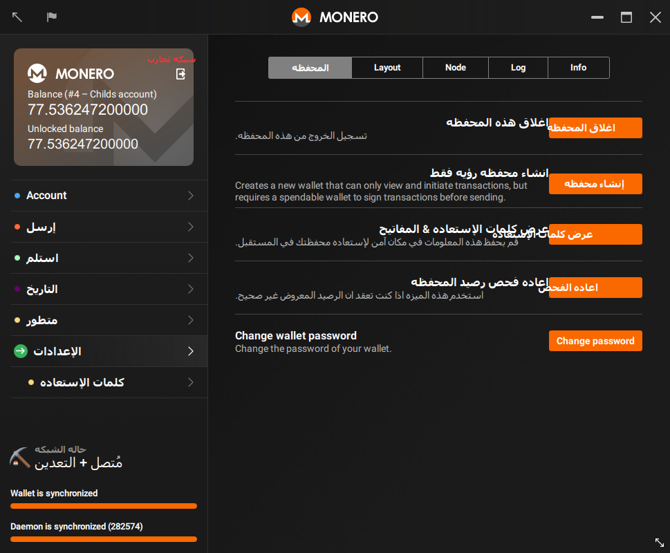
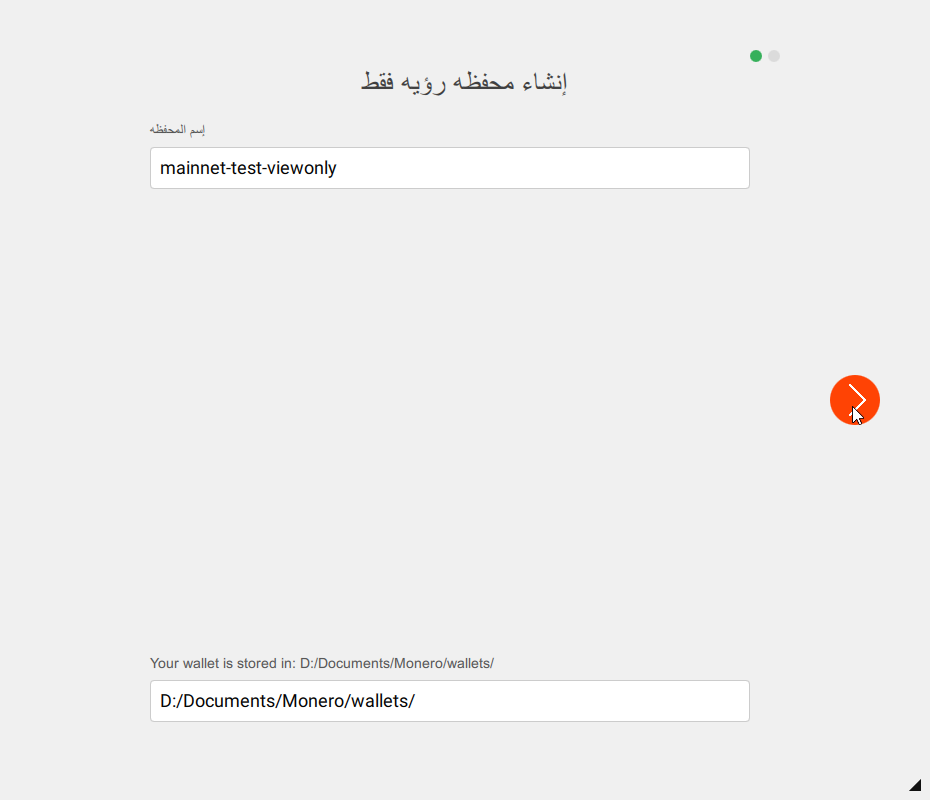
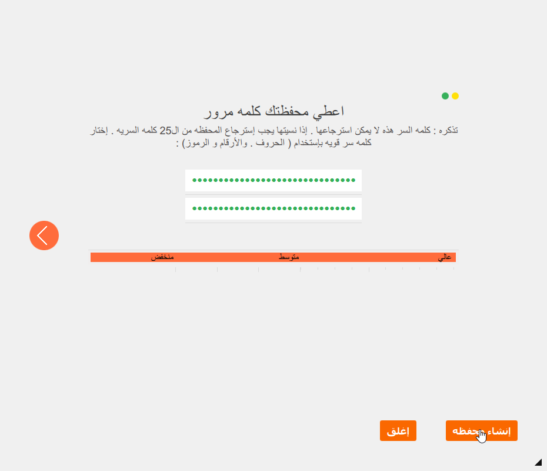
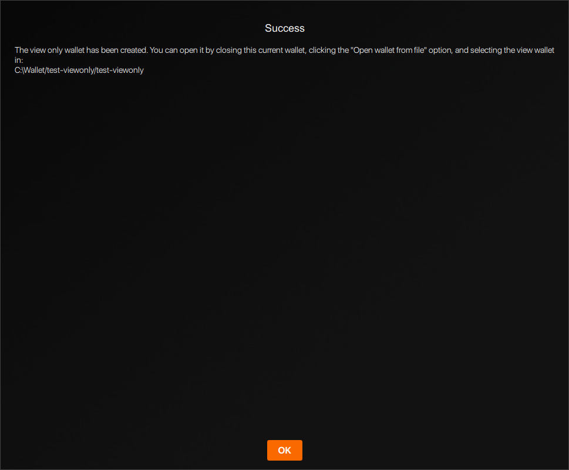



محفظه الرؤيه فقط يمكنها رؤيه المعاملات الوارده إلي المحفظه ولا يمكنها القيام بإنفاق الأموال, في الواقع لا يُمكنها حتي رؤيه المعاملات الصادره من هذه المحفظه. وهذا يجعلها مثيره للإهتمام لكل من 

* المُطورين القائمين بكتابه مكتبات للتحقق من المدفوعات
* المستخدم النهائي الذي يريد التحقق من المدفوعات إلي محفظه مجمده

### إنشاء محفظه رؤيه فقط

يُمكنك إنشاء محفظه رؤيه فقط من أي محفظه موجوده.

#### واجهه سطر الأوامر

إفتح محفظه موجوده بالفعل أو إنشيء واحده جديده بإستخدام واجهه سطر الأوامر `monero-wallet-cli`. في المحفظه قم بكتابه `address` و `viewkey` لعرض عنوان المحفظه ومفتاح الرؤيه السري. إكتب `exit` لإغلاق المحفظه.

بعد ذلك إنشيء محفظه رؤيه فقط بكتابه `monero-wallet-cli --generate-from-view-key wallet-name`.  قم بتبديل wallet-name بإسم المحفظه الذي تريده. بعدها سيتم سؤاك عن عنوان المحفظه ومفتاح الرؤيه السري قم بلصق البيانات اللازمه التي حفظتها سابقاً. بعد ذلك سيتم سؤالك لتعيين كلمه سر جديده وتأكيدها ومبروك تم إنشاء محفظه الرؤيه بنجاح.

#### GUI

إفتح محفظه موجوده بالفعل أو أنشيء محفظه جديده بإستخدام واجهه المستخدم الرسوميه `monero-wallet-gui`. وإذهب إلي صفحه الإعدادات.

إختار 'إنشاء محفظه رؤيه فقط' وعيّن إسماً للمحفظه وإختار مكان حفظها ثم إضغط علي السهم 'الأيمن':

عيّن كلمه سر قويه لمحفظه الرؤيه وقم بتأكيدها قبل النقر علي 'إنشاء المحفظه':

يُمكنك إختيارياً النقر علي كلمه 'نجح' لنسخ الرساله , وبعد ذلك إنقر علي 'تم' لإغلاقها:

