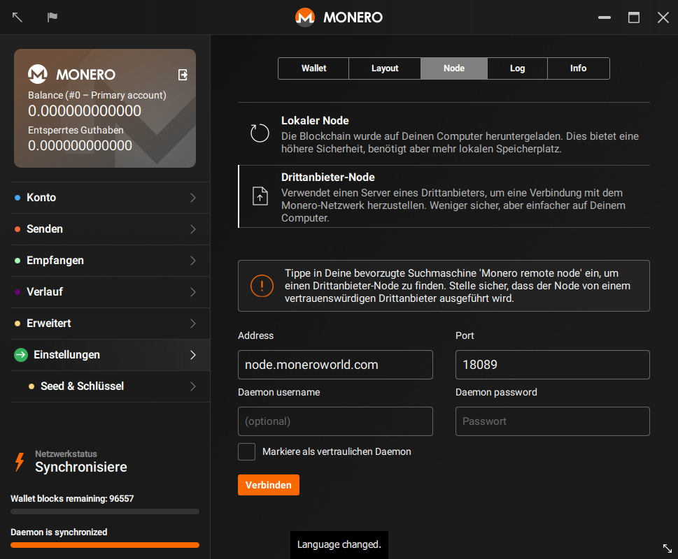



## Finding a node
First things first, you need to find a node to connect to! [moneroworld.com](https://moneroworld.com/#nodes) has some great resources for finding nodes. One of the easiest methods
would be to use a node run by moneroworld, but they have a tool for finding random nodes too.

## Connecting to the node from the GUI wallet
After you enter your password for your wallet, you will see a pop up that will give you the option to "use custom settings". Click on it. You will then be
sent to the "Settings > Node" page in the GUI. At this point you could choose 'Remote Node' see four text boxes labeled "Address", "Port", "Daemon username" and "Daemon password". Fill the address of the node that you want to connect to. This address might look like `node.moneroworld.com` or it could look like any old ip address. Then fill the "Port" box with the node's port. The default port is `18081` but if you are using a random node the port that is used will vary. The port for node.moneroworld.com uses 18089. Optionnaly, fill the username and password if your remote note requires them.
### Your screen should look a bit like this
{:width="600px"}
