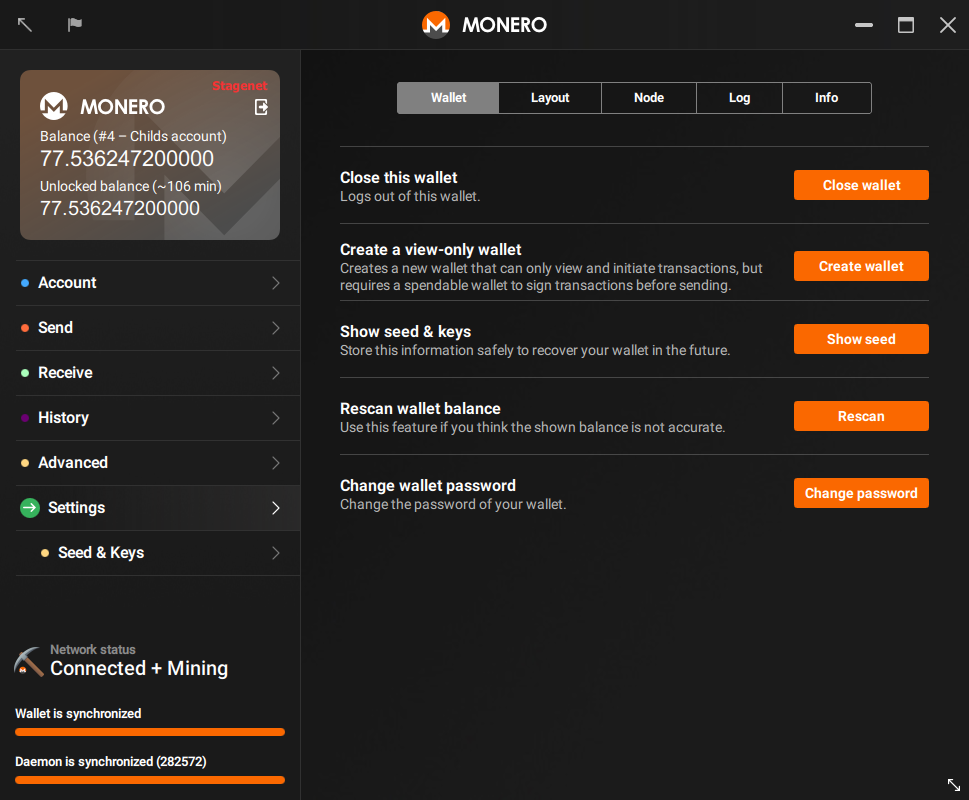



A view-only wallet can only see which incoming transactions belong to you. It can not spend any of your Monero, in fact it can't even see outgoing transactions from this wallet. This makes view-only wallets particularly interesting for

* Developers writing libraries to validate payments
* End users validating incoming transactions to cold wallets

### Creating A View-Only Wallet

You can create a view-only wallet from any existing wallet.

#### CLI

Open an existing wallet or create a new one using `monero-wallet-cli`. In the wallet, type `address` and `viewkey` to display the wallet's address and secret viewkey. Type `exit` to close the wallet.

Next, create your view-only wallet by typing `monero-wallet-cli --generate-from-view-key wallet-name`. The last argument will be your new wallet's file name. You will be prompted for `Standard address` and `View key` by the wallet. Paste in your original wallet's address and secret view key. Next, enter and confirm a password for your new wallet and you're done.

#### GUI

Open an existing wallet or create a new one using `monero-wallet-gui`. In the wallet, go to the `Settings` > `Wallet` page:

Click on `Create a view only wallet` > `Create wallet`, the wallet will be created within the same directory and using your current password.

Optionally, double-click the `Success` windows to copy the message, then click `OK` to close it:

