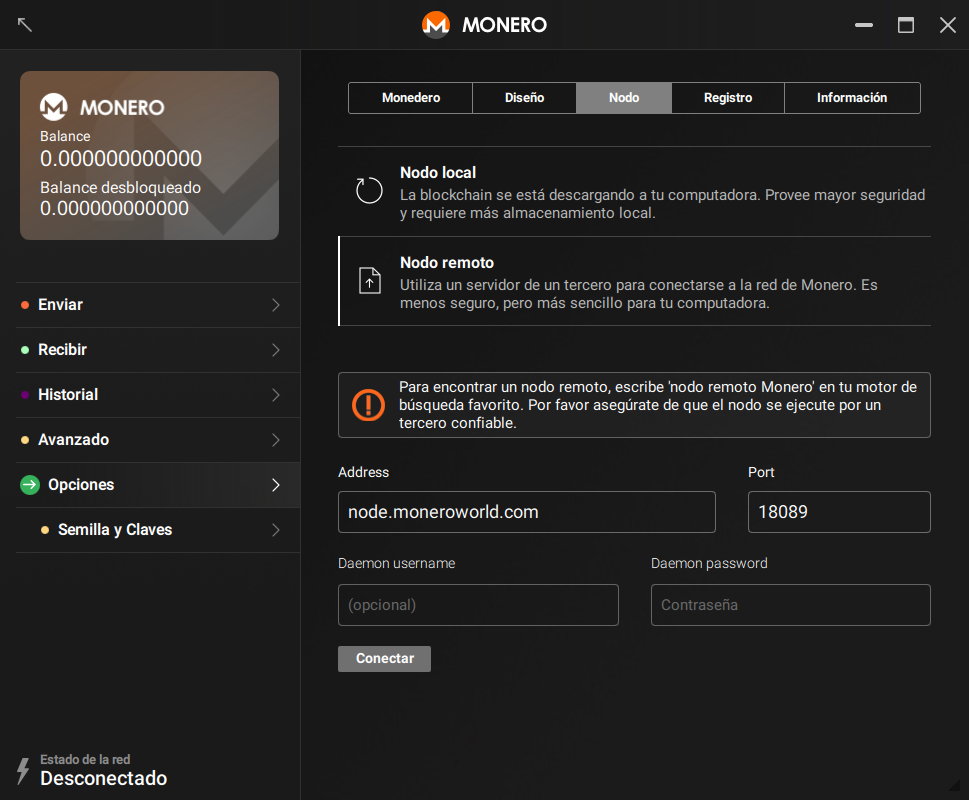



## Encontrando un nodo
Primero lo primero, necesitas encontrar un modo para conectarte. [moneroworld.com](https://moneroworld.com/#nodes) cuenta con buenos recursos para encontrar nodos. Uno de los métodos más fáciles
sería ejecutar un nodo por moneroworld, pero también tienen una herramienta para encontrar nodos aleatorios.

## Conectándose al nodo desde el monedero GUI
Después de que ingreses la contraseña de tu monedero, verás un pop-up que te dará la opción de usar configuración personalizados (use custom settings). Haz clic en él. Entonces serás
enviado a la página de ajustes en la GUI. En este punto debes ser capaz de ver dos cajas de texto en la derecha de una etiqueta llamada "Daemon address". En la primera caja (a la izquierda) necesitarás ingresar la dirección del nodo al que te deseas
conectar. Esta dirección se debe ver como `node.moneroworld.com` o puede verse como cualquier dirección ip vieja. La caja pequeña en la derecha es donde ingresas el puerto del nodo. El puerto por defecto es `18081` pero si estás usando un nodo aleatorio el puerto que es usado puede variar. El puerto para node.moneroworld.com es 18089.
### Tu pantalla se debería ver algo como esto:
{:width="600px"}
