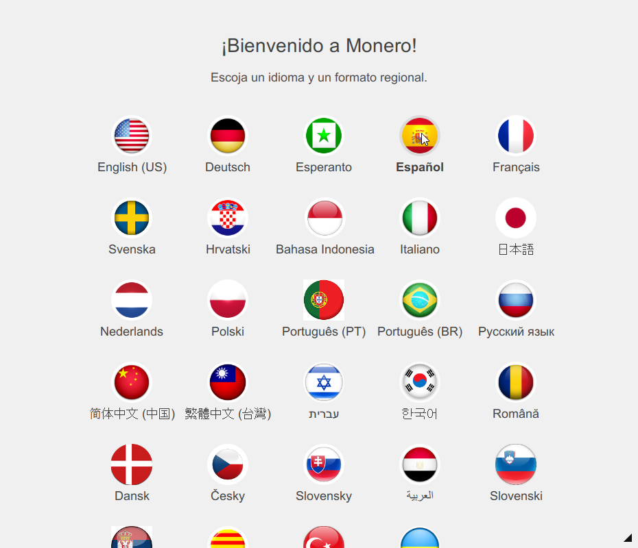
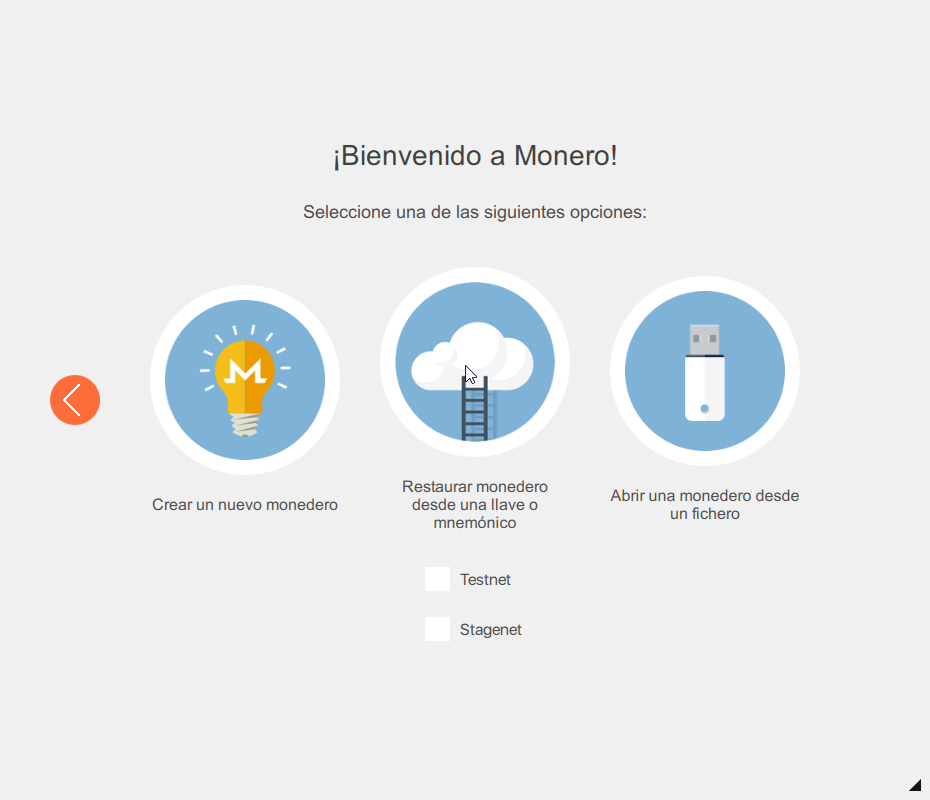
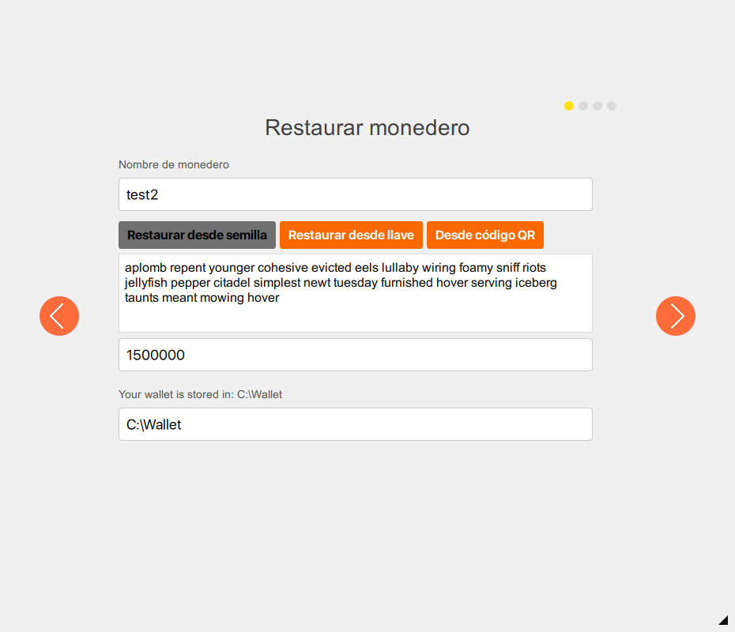
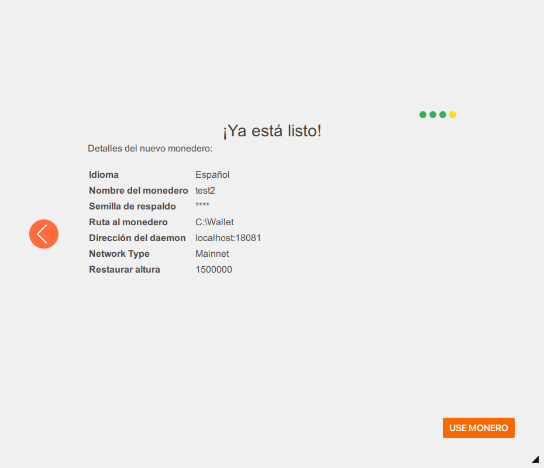



## Sistemas Operativos:  Windows, Linux, Mac

- Recupera la semilla mnemónica de 25 palabras que guardaste cuando creaste tu viejo monedero de Monero.

### Software de cuenta: monero-wallet-cli

- Abre una consola de comandos y navega al disco y directorio que contiene monero-wallet-cli.

- En la consola, escribe: `monero-wallet-cli --restore-deterministic-wallet`

- Una vez que presiones Enter se preguntará por un nuevo nombre de monedero. Escribe cualquier nombre, cualquiera funcionará.

- Presiona Enter de nuevo y se pedirá una contraseña. Da a tu monedero una nueva y larga contraseña.

- Presiona Enter de nuevo y se preguntará por repetir la contraseña.

- Presiona Enter nuevamente y se pedirá la semilla mnemónica de 25 palabras estilo electrum que recuperaste antes.

- Se pedirá ahora el restaurar desde una altura específica en la blockchain (Restore from specific blockchain height, (opcional, default 0)): Default empezará el proceso de restauración desde el inicio de la blockchain de Monero. Si no conoces la altura de bloque específica, sólo presiona Enter. (Dar una altura de bloque específica iniciará el proceso de restauración desde esa misma altura. Esto ahorrará un poco de tiempo en el escaneo, si conoces la altura de bloque en la cual tus fondos iniciales fueron tramitados para tu cuenta en específico).

Después de haber ingresado la semilla mnemónica de 25 palabras y haber elegido la altura de bloque específica, monero-wallet-cli generará la misma llave de visualización y dirección pública que tu viejo monedero e iniciará el proceso de actualización automáticamente. (Por favor sé paciente, el proceso de actualización puede tardar un tiempo).

### Software de cuenta: monero-wallet-gui

Abre `monero-wallet-gui`. Si es la primera vez que lo abres ve al siguiente paso, de otro modo, haz clic en  `Cancel`:

Selecciona el lenguaje apropiado `Español`:

Haz clic en  `Restaurar monedero de claves o semilla mnemónica`:

Mantén `Restaurar desde semilla` seleccionado, da un nombre a tu monedero y ubicación de guardado, y llena `Ingresa tu semilla mnemónica de 25 (o 24) palabras`. Opcionalmente, especifica la `Altura de restaurado (opcional)` para evitar escaneo de bloques viejos. Haz clic en la flecha de `Siguiente`:

En la página siguiente, da a tu monedero una contraseña fuerte y confírmala antes de hacer clic en la flecha de `Siguiente`:

Especifica la configuración del daemon y haz clic la flecha de `Siguiente`:

Haz clic en `USAR MONERO` para disfrutar de tu monedero restaurado:

