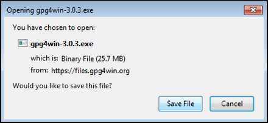
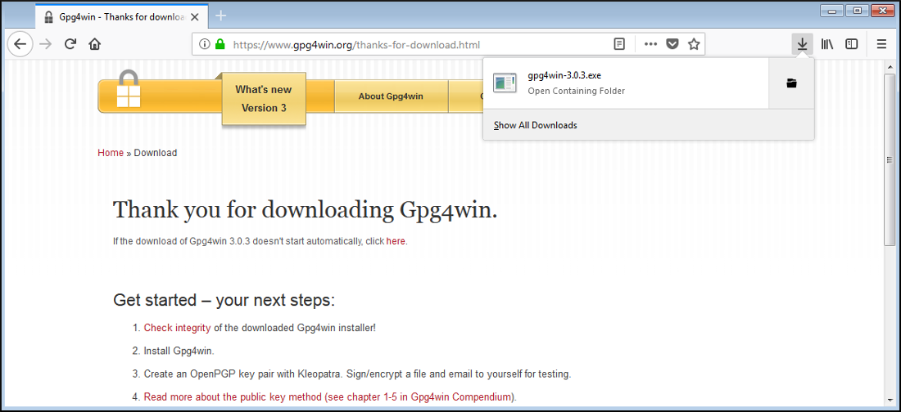
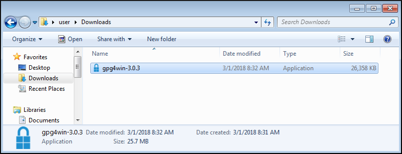
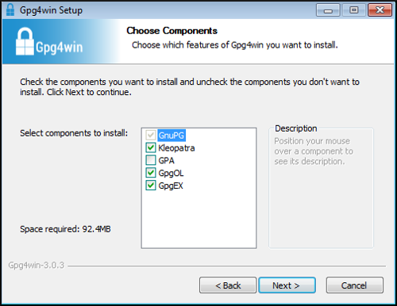
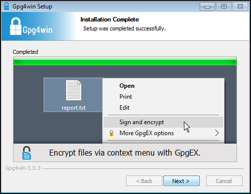
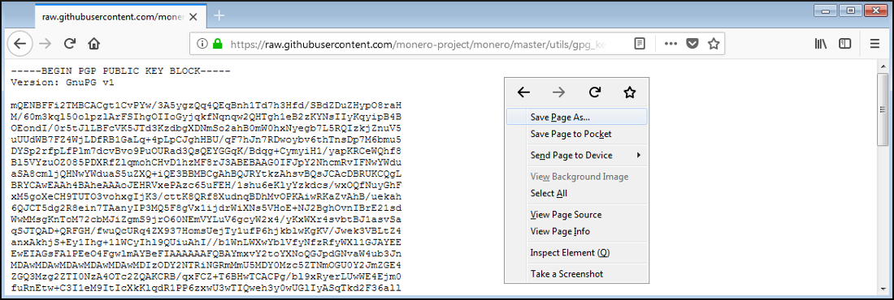
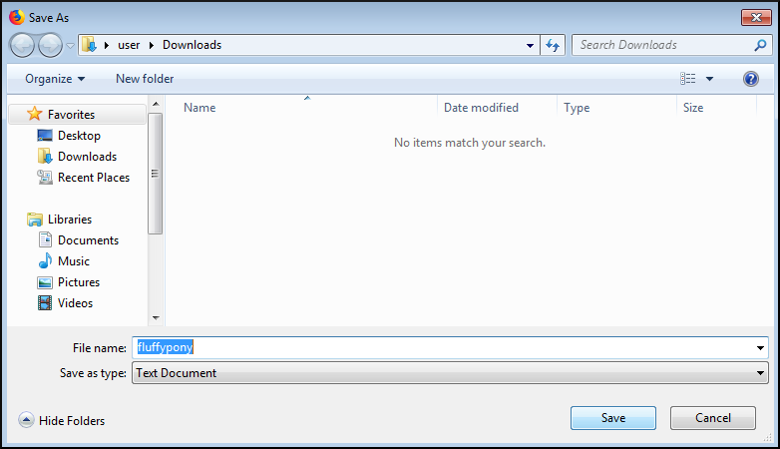
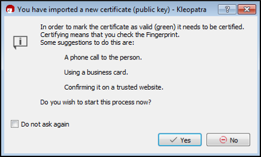
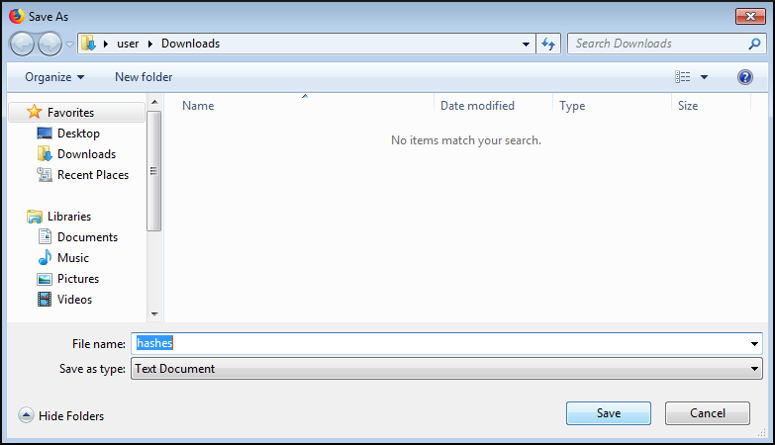
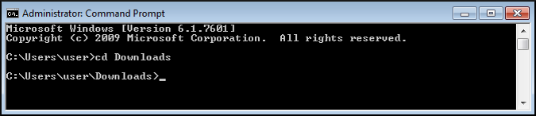



# Verificación de Binarios: Windows (Principiante)

La verificación de los archivos binarios de Monero debería ser hecha antes de extraer, instalar o usar el software Monero. Esta es la única forma de asegurar que estás utilizando software oficial de Monero. Si recibes un falso binario Monero (e.g. phishing, MITM, entre otros), seguir esta guía te protegerá de ser engañado en usarlo.

Para proteger la integridad de los binarios el equipo de Monero provee con una lista criptográficamente firmada de todos los hashes [SHA256](https://en.wikipedia.org/wiki/SHA-2). Si tus binarios descargados han sido manipulados producirán un [hash diferente](https://en.wikipedia.org/wiki/File_verification) al que está en el archivo.

Esta es una guía de principiantes para sistemas operativos Windows y hace uso de la GUI casi exclusivamente. Te llevará por el proceso de instalar software requerido, importar la clave de firma, descargar los archivos necesarios, y finalmente verificar que tu binario es auténtico.

## Tabla de Contenidos

### [1. Instalador Gpg4win](#1-using-gpg4win-installer)
  - [1.1. Obtener el Instalador Gpg4win](#11-getting-gpg4win-installer)
    + [1.1.1. Descargar Gpg4win](#111-download-gpg4win)
    + [1.1.2. Abrir Gpg4win](#112-launch-gpg4win)
  - [1.2. Usar el Instalador Gpg4win](#12-use-gpg4win-installer)
### [2. Importar Clave de Firma](#2-monero-signing-key)
  - [2.1. Descargar Clave de Firma](#21-download-signing-key)
  - [2.2. Inicializar Kleopatra](#22-initialize-kleopatra)
    + [2.2.1. Importar Clave de Firma](#221-import-signing-key)
    + [2.2.2. Crear Par de Clave](#222-create-key-pair)
  - [2.3. Verificar Clave de Firma](#23-verify-signing-key)
### [3. Verificar Archivo Hash](#3-hash-file-verification)
  - [3.1. Descargar Archivo Hash](#31-download-hash-file)
  - [3.2. Verificar Archivo Hash](#32-verify-hash-file)
### [4. Verificar Archivo Binario](#4-binary-file-verification)
  - [4.1. Descargar Binario](#41-download-binary)
  - [4.2. Verificar Binario](#42-verify-binary)

## 1. Usar el Instalador Gpg4win

Esta sección cubre la instalación de software criptográfico. Windows no viene con las herramientas requeridas para verificar tus binarios. Para instalar estas herramientas puedes utilizar el instalador Gpg4win.

### 1.1. Obtener el Instalador Gpg4win

#### 1.1.1. Descargar Gpg4win

En un navegador web, ve a [gpg4win.org](https://gpg4win.org) y descarga el instalador haciendo clic en el botón verde.

Serás llevado a una página de donación. Si no deseas donar selecciona `$0`, y serás capaz de hacer clic en `Download`.

Haz clic  en `Guardar archivo`.

Elige una dirección de descarga, y haz clic en `Guardar`.

#### 1.1.2. Abrir Gpg4win

Cuando la descarga termine, abre la carpeta contenedora.

Haz doble clic en el ejecutable descargado para abrirlo.

### 1.2. Usar el Instalador Gpg4win

Serás presentado con una pantalla de verificación de seguridad. Haz clic en `Run`.

Selecciona tu lenguaje, y haz clic en `OK`.

Una pantalla de bienvenida aparecerá, haz clic en `Next`.

Ahora verás la pantalla de selección de componentes, en donde debes dejar `Kleopatra` marcado para esta guía. Haz tu selección, y haz clic en `Next`.

Es mejor dejar la ubicación de instalación por defecto a menos que sepas lo que estás haciendo. Haz tu selección, y haz clic en `Install`.

La instalación se ha completado, haz clic en `Next`.

Haz clic en `Finish`.

## 2. Clave de Firma Monero

Esta sección cubrirá la descarga de la clave de firma Monero, verificar que la clave sea correcta, e importar la clave a tu llavero. El archivo hash que será usado para verificar tus binarios está criptográficamente firmado con la clave de firma Monero. Para revisar la validez del archivo debes tener la versión pública de la clave de firma.

### 2.1. Descargar Clave de Firma

En un navegador web, ve a [Fluffypony's GPG key](https://raw.githubusercontent.com/monero-project/monero/master/utils/gpg_keys/fluffypony.asc), que utiliza para firmar los binarios Monero. Haz clic derecho en la página y selecciona `Guardar página como`.

Deja la ubicación por defecto, y haz clic en `Guardar`.

### 2.2. Inicializar Kleopatra

Si es tu primera vez usando Kleopatra tendrás que crear un par de clave para para ti.

Abre Kleopatra.

#### 2.2.1. Importar Clave de Firma

Haz clic en `Importar`.

Ingresa el directorio de `Descargas`, selecciona `fluffypony`, y haz clic en `Abrir`.

Inicia el proceso de certificación de la clave presionando `Yes`.

#### 2.2.2. Crear Par de Clave

Inicia el proceso de creación de clave presionando `Yes`.

Llena algunos detalles para `Name` y `Email`, y haz clic en `Next`.

Verifica los detalles, y haz clic en `Create`.

Establece una contraseña, y haz clic en `OK`.

Haz clic en `Finish`.

### 2.3. Verificar Clave de Firma

Revisa visualmente que la huella de la clave perteneciente a Riccardo Spagni es `BDA6BD7042B721C467A9759D7455C5E3C0CDCEB9`.

Si la huella **SÍ** coincide, haz clic en `Next`.

Si la huella de clave **NO** coincide, **NO CONTINÚES**. En su lugar elimina el archivo `fluffypony` de `Descargas` y regresa a la [sección 2.1](#21-download-signing-key).

Deja `Certify only for myself` seleccionado, y haz clic en `Certify`.

Ingresa tu contraseña, haz clic en `OK`.

Haz clic en `Finish`.

## 3. Verificación del Archivo Hash

Esta sección cubrirá la descarga del archivo firmado conocido de buenos hashes y la verificación de su autenticidad.

### 3.1. Descargar el Archivo Hash

En un navegador web, ve a la [página de hashes en getmonero.org](https://getmonero.org/downloads/hashes.txt). Haz un clic derecho en la página, y selecciona `Guardar página como`.

Deja la ubicación por defecto, y haz clic en `Save`.

### 3.2. Verifica el Archivo Hash

En Kleopatra, haz clic en el botón de `Decrypt/Verify`.

Navega a `Descargas`. Selecciona el archivo `hashes`, haz clic en `Abrir`.

Kleopatra te informará si los archivos de firma son válidos.

Si la firma es **VÁLIDA** verás esto:

Si la firma es **INVÁLIDA** verás esto:

Si recibes una firma **VÁLIDA**, haz clic en`Discard` y continua.

Si recibes una firma **INVÁLIDA**, **NO CONTINÚES.** En su lugar elimina el archivo `hashes` de `Descargas` y regresa a la [sección 3.1](#31-download-hash-file).

## 4. Verificación de Archivos Binarios

Esta sección cubrirá la descarga del archivo binario Monero y la verificación de su autenticidad.

### 4.1. Descargar Binario

En un navegador web, ve a la [página de descargas de getmonero.org](https://getmonero.org/downloads/#windows). Selecciona el binario correcto para tu sistema.

Deja `Guardar archivo` seleccionado, haz clic en `OK`.

Deja la ubicación por defecto, haz clic en `Save`.

### 4.2. Verificar Binarios

En un administrador de archivos, navega a `Descargas`. Abre el archivo `hashes` con un editor de texto.

Abre una terminal (`cmd.exe`).

Cambia al directorio de `Descargas` con el comando: `cd Descargas`.

Calcula el hash del binario Monero con el comando: `certUtil -hashfile monero-gui-win-x64-v0.11.1.0.zip SHA256` (si descargaste una versión de consola de comandos solamente, cambia `monero-gui-win-x64-v0.11.1.0.zip` de acuerdo a tu binario).

Compara el hash de la terminal con el que está en tu archivo hash. Deberían ser el mismo (los espacios pueden ignorarse).

Si tu hash **SÍ** coincide entonces has terminado con la verificación! Puedes estar seguro de que tus archivos Monero son auténticos. Puedes extraer e instalar/utilizar los archivos normalmente.

Si tu hash **NO** coincide **NO CONTINÚES.** En su lugar elimina el binario Monero de `Descargas` y regresa a la [sección 4.1](#41-download-binary).
