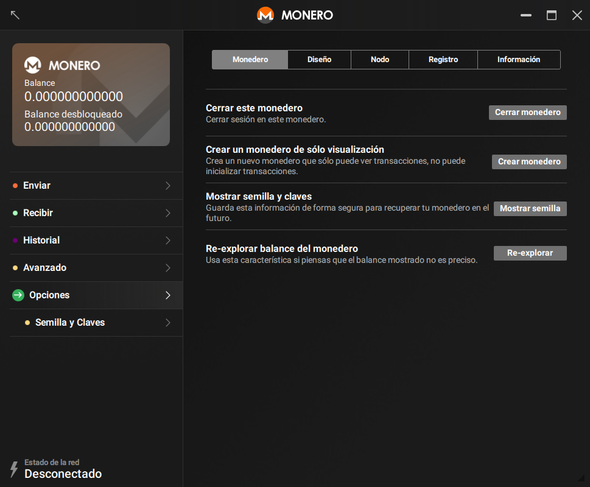
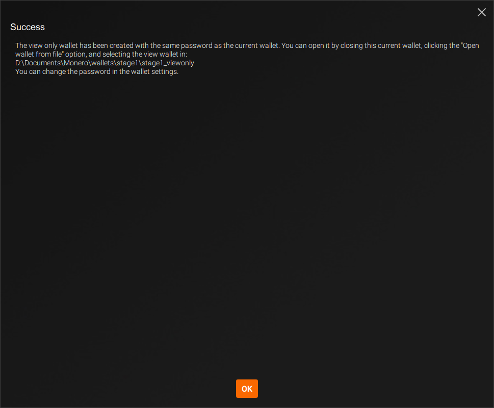



Un monedero de visualización solamente puede ver qué transacciones de entrada te pertenecen. No puede utilizar nada de tu Monero, de hecho ni siquiera puede ver las transacciones de salida del monedero. Esto hace a los monederos de sólo visualización interesantes para

* Desarrolladores escribiendo librerías para validar pagos
* Usuarios finales validando transacciones de entrada para monederos de almacenamiento en frío

### Creando un Monedero de Visualización

Puedes crear un monedero de visualización de cualquier monedero existente.

#### CLI

Abre un monedero existente o crea uno nuevo usando `monero-wallet-cli`. En el monedero, escribe `address` y `viewkey` para mostrar la dirección del monedero y la clave secreta de visualización. Escribe `exit` para cerrar el monedero.

A continuación, crea tu monedero de visualización escribiendo `monero-wallet-cli --generate-from-view-key wallet-name`. El último argumento será el nuevo nombre de tu monedero. Se te preguntará por un `Standard address` y `View key` por el monedero. Pega la dirección original de tu monedero y la clave secreta de visualización. A continuación, ingresa y confirma una contraseña para tu nuevo monedero y estarás listo.

#### GUI

Abre un monedero existente o crea uno nuevo usando `monero-wallet-gui`. En el ejemplo, ve a la página de `Opciones` > `Monedero`

Haz clic en `Crear un monedero de sólo visualización` > `Crear monedero`, the wallet will be created within the same directory and using your current password.

Opcionalmente, haz doble clic en la ventana `Éxito` para copiar el mensaje, y haz clic en `OK` para cerrarlo:

