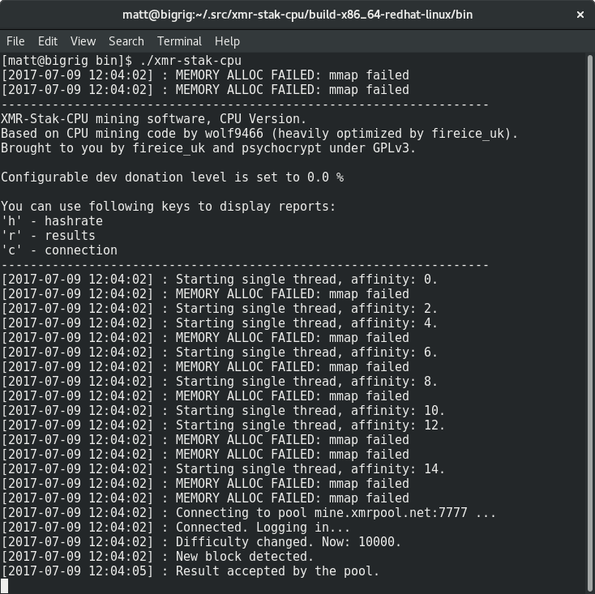



# Choisir un pool

Il y a de nombreux pool parmi lesquels choisir, une liste est disponible sur
[moneropools.com](https://moneropools.com). Miner sur un grand pool signifie
des paiements plus fréquent, mais miner sur un pool plus petit permet de
maintenir la décentralisation du réseau.

# Choisir un mineur

Tout comme pour les pools, il y a de nombreuses applications d'extraction minière parmi lesquelles
choisir. Celle que vous sélectionnerez dépendra du matériel sur lequel vous aller
miner. Ce guide va se concentrer sur un mineur pour CPU, et utilisera
[xmr-stak-cpu](https://github.com/fireice-uk/xmr-stak-cpu). Alternativement, vous
pouvez utiliser [wolf's CPUMiner](https://github.com/wolf9466/cpuminer-multi) ou
[sgminer-gm](https://github.com/genesismining/sgminer-gm). Cependant, leurs
configurations sont légèrement différentes et ne seront pas abordés dans ce guide.

## Pour Windows

Si vous utilisez Windows, le développeur de xmr-stak-cpu fournit des binaires à
télécharger sur page
[GitHub Version](https://github.com/fireice-uk/xmr-stak-cpu/releases).

Téléchargez et décompressez `xmr-stak-cpu-win64.zip` à un endroit où vous pourrez
le retrouver.

## Pour d'autres systèmes d'exploitation

Si vous n'utilisez pas windows, vous devrez compiler xmr-stak-cpu vous-même,
heureusement ce n'est pas si difficile qu'il n'y parait. Avant de pouvoir compiler
le mineur, vous devez installer certains de ses prérequis.

Pour les distributions basées sur Debian :

    sudo apt-get install libmicrohttpd-dev libssl-dev cmake build-essential

Pour les distributions basées sur Red Hat :

	sudo yum install openssl-devel cmake gcc-c++ libmicrohttpd-devel

<!-- TODO: Add dependencies for other operating systems? -->

Après cela, vous n'avez plus qu'à utiliser cmake pour générer les fichier
nécessaires, lancer make et copier le fichier de configuration :

    mkdir build-$(gcc -dumpmachine)
	cd $_
	cmake ../
	make -j$(nproc)
	cp ../config.txt bin/
	cd bin

Ne criez pas victoire tout de suite, car le mineur doit encore être
onfiguré. Lancer le mineur maintenant devrait vous donner un bloc de
texte à copier et coller :

Ouvrez `config.txt` et *remplacez* les deux lignes `"cpu_threads_conf"` avec le
texte que vous venez de copier. Après-coup, voici à quoi cela devrait recembler :

Descendez dans le fichier jusqu'à trouver le ligne contenant `"pool_address"`.
*Remplacez* le contenu du second jeux de guillemets avec l'adresse et le port du
pool que vous avez précédemment choisis. Vous pourrez trouver ces informations sur
le site web du pool.

Saisissez l'adresse de votre portefeuille entre les guillemets sur la ligne "wallet
address". Vous pouvez laisser le mot de passe vierge, sauf avis contraire du pool.

Après cela, votre configuration devrait ressembler à ceci :

# Lancer le mineur

**Sauvegardez le fichier de configuration** et lancez le mineur !

Certains pools vous permettent d'observer votre taux de hachage en collant votre
adresse sur leur site web. Vous pouvez également surveiller votre taux de hachage en
tapant la touche `h`.

# Ajuster le lgiciel d'extraction minière

Vous pourriez voir des messages désagréables comme ceci :

	[2017-07-09 12:04:02] : MEMORY ALLOC FAILED: mmap failed

Cela signifie que vous pourriez obtenir une amélioration du taux de hachage d'environ
20% en activant les pages larges.

## Pages larges sur linux

Tout d'abord, arrêtez le mineur (s'il est en fonctionnement), lancez la
commande suivante pour activer les pages larges puis redémarrez l'application
d'extraction minière en tant que root :

	sudo sysctl -w vm.nr_hugepages=128
	sudo ./xmr-stak-cpu

## Pages larges sur Windows

Comme expliqué dans `config.txt`:

>By default we will try to allocate large pages. This means you need to "Run As Administrator" on Windows
You need to edit your system's group policies to enable locking large pages. Here are the steps from MSDN
1. On the Start menu, click Run. In the Open box, type gpedit.msc.
2. On the Local Group Policy Editor console, expand Computer Configuration, and then expand Windows Settings.
3. Expand Security Settings, and then expand Local Policies.
4. Select the User Rights Assignment folder.
5. The policies will be displayed in the details pane.
6. In the pane, double-click Lock pages in memory.
7. In the Local Security Setting – Lock pages in memory dialog box, click Add User or Group.
8. In the Select Users, Service Accounts, or Groups dialog box, add an account that you will run the miner on
9. Reboot for change to take effect.
