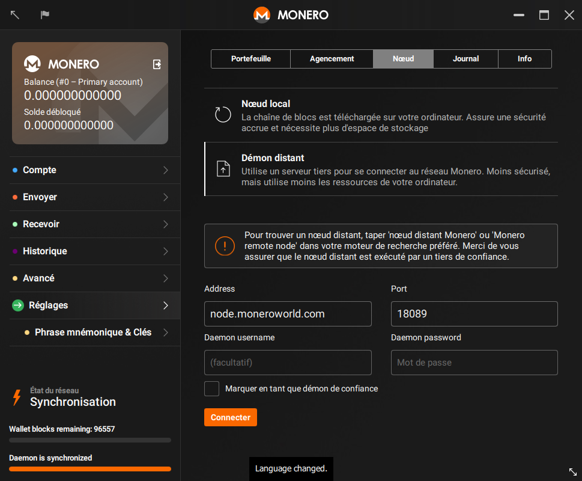

## Trouver un nœud
Commencez par le commencement, vous devez trouver un nœud auquel vous connecter ! [moneroworld.com](https://moneroworld.com/#nodes) propose quelques bonnes ressources pour trouver
des nœuds. L'une des méthodes les plus simple serait d'utiliser un nœud appartenant à moneroworld, mais ils propose également un outil pour trouver des nœuds aléatoires.

## Connecter le portefeuille GUI au nœud
Après avoir saisit votre mot de passe dans votre portefeuille, vous verrez une notification que vous donnera la possibilité de configurer des "Paramètres personnalisés". Cliquez dessus.
Vous serez alors envoyé à la page "Paramètres" de la GUI. A ce moment là vous devriez voir deux champs texte à droite d'un libellé qui indique "Adresse du démon". Dans le premier champ texte
(celui de gauche) saisissez l'adresse du nœud auquel vous voulez vous connecter. Cette adresse pourrait ressembler à `node.moneroworld.com` où à une bonne vielle adresse IP. Le champ texte
plus petit à droite est celui dans lequel vous saisissez le port du nœud. Le port par défaut est `18081` mais si vous utilisez un nœud aléatoire, le port qu'il utilise peut varier.
node?moneroworld.com utilise le port 18089.
### Votre écran devrait ressembler un peu à cela

