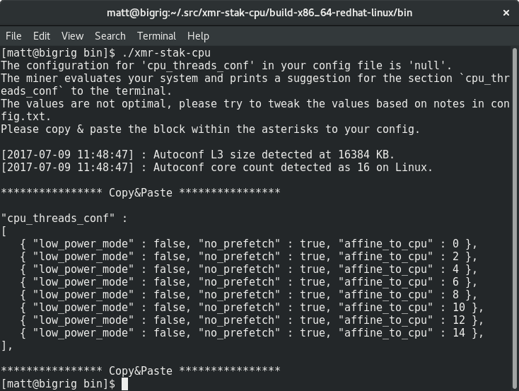



# Een pool selecteren

Je kunt uit allerlei pools kiezen. Er staat een lijst op
[moneropools.com](https://moneropools.com). Als je bij een grotere pool minet, kun je
vaker betaald worden, maar als je bij een kleinere pool minet, help je het netwerk
gedecentraliseerd te houden.

# Een CPU-miningprogramma selecteren

Net als pools zijn er veel miningprogramma's waaruit je kunt kiezen. Welke soort software
je nodig hebt hangt af van de hardware waarop je wilt minen. Deze handleiding gaat over
minen op een CPU, en daarvoor gebruiken we
[xmr-stak-cpu](https://github.com/fireice-uk/xmr-stak-cpu). Andere mogelijkheden zijn onder meer
[wolf's CPUMiner](https://github.com/wolf9466/cpuminer-multi) en
[sgminer-gm](https://github.com/genesismining/sgminer-gm). Maar de
configuratie daarvan is net iets anders en wordt hier niet behandeld.

## Voor Windows-systemen

Als je een Windows-systeem gebruikt, kun je de binaries van xmr-stak-cpu
downloaden op de
[release-pagina op GitHub](https://github.com/fireice-uk/xmr-stak-cpu/releases).

Download `xmr-stak-cpu-win64.zip` en pak het uit op een plek waar je
het kunt terugvinden.

## Voor andere besturingssystemen

Als je niet Windows gebruikt, moet je zelf xmr-stak-cpu compileren.
Gelukkig is dat niet zo moeilijk als het klinkt. Voordat je het miningprogramma kunt compileren,
moet je een paar vereiste onderdelen installeren.

Voor distributies op basis van Debian:

    sudo apt-get install libmicrohttpd-dev libssl-dev cmake build-essential

Voor distributies op basis van Red Hat:

	sudo yum install openssl-devel cmake gcc-c++ libmicrohttpd-devel

<!-- TODO: Add dependencies for other operating systems? -->

Hierna hoef je alleen nog de build-bestanden te maken met cmake,
make uit te voeren en het configuratiebestand te kopiëren:

    mkdir build-$(gcc -dumpmachine)
	cd $_
	cmake ../
	make -j$(nproc)
	cp ../config.txt bin/
	cd bin

Juich niet te vroeg, want het miningprogramma moet nog worden geconfigureerd. Als je het miningprogramma nu uitvoert,
wordt er een blok tekst weergegeven om te kopiëren en plakken:

Open `config.txt` en *vervang* de twee regels `"cpu_threads_conf"` met de tekst
die je net hebt gekopieerd. Daarna zou het er ongeveer zo uit moeten zien:

Schuif omlaag in het bestand tot je bij de regels met `"pool_address"` bent.
*Vervang* de inhoud van het tweede stel aanhalingstekens met het adres en de poort van
de pool die je eerder hebt gekozen. Je kunt deze informatie op de website van de pool vinden.

Plak het adres van je portemonnee tussen de aanhalingstekens bij `wallet_address`. Je kunt het
wachtwoord leeg laten, tenzij de pool een wachtwoord vereist.

Hierna zou je configuratie er ongeveer zo uit moeten zien:

# Het miningprogramma uitvoeren

**Sla het configuratiebestand op** en voer het miningprogramma uit.

Bij sommige pools kun je je hashrate volgen door je adres in te voeren op hun
website. Je kunt de hashrate ook zien door op de toets `h` te drukken.

# Het miningprogramma afstellen

Mogelijk krijg je vervelende meldingen als deze te zien:

	[2017-07-09 12:04:02] : MEMORY ALLOC FAILED: mmap failed

Dit betekent dat je je hashrate met ongeveer 20% kunt verhogen door grote pagina's in te schakelen.

## Grote pagina's in Linux

Stop eerst het miningprogramma (als het aan staat), voer de volgende opdrachten uit om
grote pagina's in te schakelen en start vervolgens het miningprogramma als root:

	sudo sysctl -w vm.nr_hugepages=128
	sudo ./xmr-stak-cpu

## Grote pagina's in Windows

Geciteerd uit `config.txt`:

Standaard proberen we grote pagina's toe te wijzen. Hiervoor moet je het programma als Administrator uitvoeren in Windows.
Je moet het vergrendelen van grote pagina's inschakelen in het groepsbeleid van je systeem. Dit zijn de stappen volgens MSDN:
1. Klik in het Startmenu op `Uitvoeren`. Typ gpedit.msc in het vak `Openen`.
2. In de console van de `Editor voor lokaal groepsbeleid` vouw je `Computerconfiguratie` uit, en vervolgens `Windows-instellingen`.
3. Vouw `Beveiligingsinstellingen` uit, en vervolgens `Lokaal beleid`.
4. Selecteer de map `Toewijzing van gebruikersrechten`.
5. De beleidsregels worden weergegeven in het detailvenster.
6. Dubbelklik in het deelvenster op `Pagina's in het geheugen vergrendelen`.
7. Klik in het dialoogvenster `Lokale beveiligingsinstelling` – `Pagina's in het geheugen vergrendelen` op `Gebruiker of groep toevoegen`.
8. Voeg in het dialoogvenster `Gebruikers of groepen selecteren` een account toe waarop u het miningprogramma wilt uitvoeren.
9. Start de computer opnieuw op om de wijziging door te voeren.
