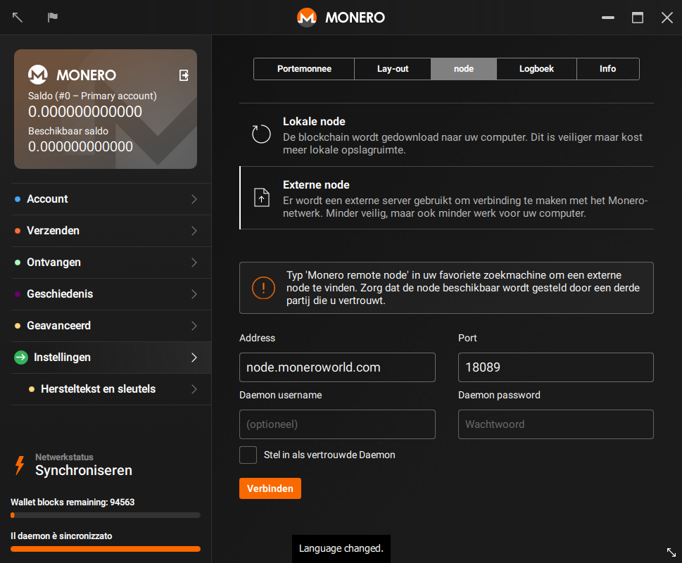



## Een node vinden
Eerst moet je natuurlijk een node vinden om verbinding mee te maken! [moneroworld.com](https://moneroworld.com/#nodes) biedt uitstekende hulpmiddelen voor het vinden van nodes. Een van de eenvoudigste methoden
is een node van moneroworld zelf gebruiken, maar ze bieden ook een hulpmiddel aan voor het vinden van willekeurige nodes.

## Verbinding maken met de node vanuit de grafische interface
Nadat je het wachtwoord voor je portemonnee hebt ingevoerd, wordt een scherm weergegeven waarin de optie "Gebruik aangepaste instellingen" staat. Klik op die optie. Dan word je
doorgeleid naar de pagina "Instellingen > Node" van de grafische interface (GUI). Hier kun je de optie 'Externe node' kiezen. Dan zie je vier tekstvakken met de labels "Address", "Port", "Daemon username" en "Daemon password". Voer het adres in van de node waarmee je verbinding wilt maken. Het adres kan eruitzien als `node.moneroworld.com`, of het is een IP-adres. Vul vervolgens in het vak "Poort" de poort van de node in. De standaardpoort is `18081`, maar als je een willekeurige node gebruikt, kan die node een andere poort gebruiken. De poort voor node.moneroworld.com is 18089. Eventueel kun je een gebruikersnaam en wachtwoord invullen als dat nodig is voor deze node.
### Het scherm hoort er ongeveer zo uit te zien
{:width="600px"}
