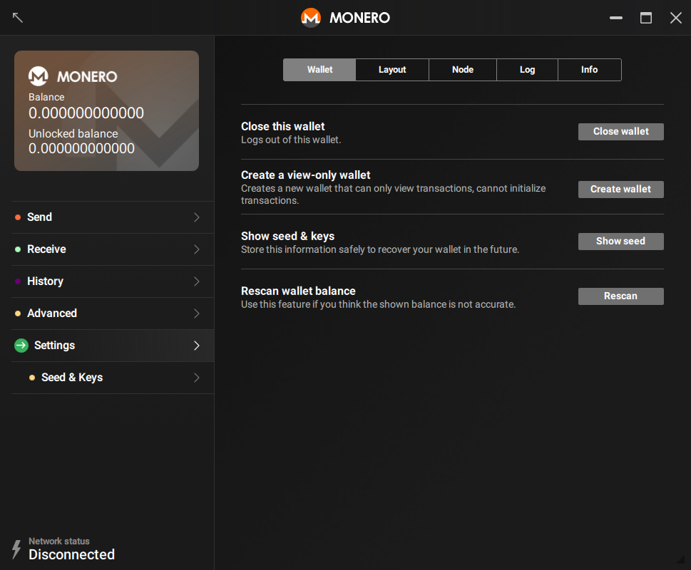
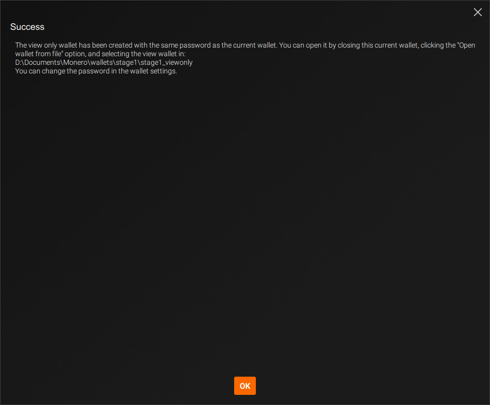



Met een alleen-lezen portemonnee kun je alleen zien welke binnenkomende transacties van jou zijn. Je kunt er geen Monero mee uitgeven. Sterker nog, je kunt zelfs uitgaande transacties vanuit deze portemonnee niet zien. Alleen-lezen portemonnees zijn daarom interessant voor:

* Ontwikkelaars die libraries voor het valideren van betalingen programmeren
* Eindgebruikers die binnenkomende transacties van een offline portemonnee (*cold wallet*) willen valideren

### Een alleen-lezen portemonnee maken

Je kunt in elke bestaande portemonnee een alleen-lezen portemonnee maken.

#### Opdrachtregel

Open een bestaande portemonnee of maak een nieuwe met `monero-wallet-cli`. Typ in de portemonnee `address` en `viewkey` om het adres en de geheime alleen-lezen sleutel weer te geven. Typ `exit` om de portemonnee af te sluiten.

Vervolgens kun je je alleen-lezen portemonnee aanmaken door het volgende te typen: `monero-wallet-cli --generate-from-view-key wallet-name`. Het laatste argument is de bestandsnaam van je nieuwe portemonnee. Het programma vraagt naar een `Standard address` (standaardadres) en `View key` (alleen-lezen sleutel). Voer het adres en de geheime alleen-lezen sleutel van je oorspronkelijke portemonnee in. Voer daarna een wachtwoord in voor je nieuwe portemonnee, en klaar is Kees.

#### Grafische interface

Open een bestaande portemonnee of maak een nieuwe met `monero-wallet-gui`. Ga in de portemonnee naar de pagina `Instellingen` > `Portemonnee`:

Klik op `Maak een alleen-lezen portemonnee aan` > `Portemonnee maken`, the wallet will be created within the same directory and using your current password.

Dubbelklik eventueel op het scherm `Geslaagd` om het bericht te kopiëren en klik vervolgens op `OK` om het te sluiten:

