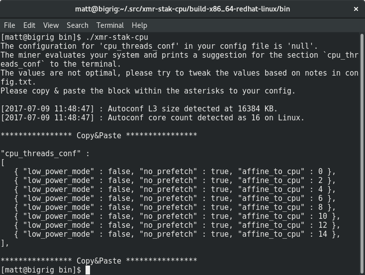

# Wybieranie zrzeszenia

Istnieje wiele zrzeszeń do wyboru. Lista dostępna jest na stronie [moneropools.com](https://moneropools.com). Wydobywanie w większym zrzeszeniu może oznaczać częstszą wypłatę, ale to wydobywanie w mniejszej grupie pomaga utrzymać sieć zdecentralizowaną.

# Wybieranie koparki CPU

Tak jak i zrzeszenia, istnieje wiele koparek do wyboru. Twój wybór powinien zależeć od sprzętu, na którym chcesz wydobywać. Ten przewodnik opisuje jedynie koparki CPU i używa [xmr-stak-cpu](https://github.com/fireice-uk/xmr-stak-cpu). Inną opcją są [wolf's CPUMiner](https://github.com/wolf9466/cpuminer-multi) oraz [sgminer-gm](https://github.com/genesismining/sgminer-gm), jednak ich ustawienia są trochę inne i nie są włączone w ten przewodnik.

## Dla Windowsa

Jeżeli używasz Windowsa, deweloper xmr-stak-cpu dostarcza plików binarnych do ściągnięcia na [stronie GitHuba](https://github.com/fireice-uk/xmr-stak-cpu/releases).

Ściągnij plik `xmr-stak-cpu-win64.zip` i wypakuj do miejsca, które łatwo później odnajdziesz.

## Pozostałe systemy operacyjne

Jeśli nie korzystasz z Windowsa, będziesz musiał skompilować xmr-stak-cpu samemu. Na szczęście to nie takie trudne, jak się wydaje. Zanim skompilujesz koparkę, będziesz musiał zainstalować kilka wymaganych komponentów.

Dystrybucje oparte na Debianie:

    sudo apt-get install libmicrohttpd-dev libssl-dev cmake build-essential

Dystrybucje oparte na Red Hat:

	sudo yum install openssl-devel cmake gcc-c++ libmicrohttpd-devel

<!-- TODO: Add dependencies for other operating systems? -->

Następnie wystarczy użyć cmake do wygenerowania plików kompilacji, uruchomić je i skopiować plik konfiguracyjny:

    mkdir build-$(gcc -dumpmachine)
	cd $_
	cmake ../
	make -j$(nproc)
	cp ../config.txt bin/
	cd bin

Jeszcze nie świętuj. bo koparka musi zostać skonfigurowana. Uruchomienie jej w tym momencie powinno spowodować ukazanie się bloku tekstu do skopiowania i wklejenia:

Otwórz plik `config.txt` i *zamień* dwie linie `"cpu_threads_conf"` na tekst, który właśnie skopiowałeś. Potem powinno wyglądać to tak:

Przewiń plik aż odnajdziesz linie zawierające `"pool_address"`. *Zamień* zawartość drugiego cudzysłowiu na adres i port zrzeszenia, które wcześniej wybrałeś. Znajdziesz tę informację na stronie zrzeszenia.

Wstaw adres swojego portfela między cudzysłów z adresem. Hasło możesz zostawić puste, chyba że zrzeszenie sprecyzuje inaczej.

Po tym, twoja konfiguracja powinna wyglądać mniej więcej tak:

# Uruchomienie koparki

**Zapisz plik konfiguracyjny** i uruchom koparkę!

Niektóre zrzeszenia pozwalają na monitorowanie twojej prędkości haszowania poprzez wklejenie twojego adresu na ich stronę. Możesz także śledzić ją, klikając klawisz `h`.

# Ustawienia koparki

Możesz zobaczyć takie niemiłe wiadomości:

	[2017-07-09 12:04:02] : MEMORY ALLOC FAILED: mmap failed

Oznacza to, że możesz zwiększyć swoją prędkość haszowania o około 20% poprzez włączenie dużych stron.

## Duże strony w Linuxie

Najpierw zatrzymaj koparkę, jeśli jest włączona. Uruchom poniższą funkcję, aby włączyć duże strony, a następnie uruchom koparkę jako root:

	sudo sysctl -w vm.nr_hugepages=128
	sudo ./xmr-stak-cpu

## Duże strony w Windowsie

Wzięte z `config.txt`:

>Opcja użycia dużych stron jest domyślnie wyłączona. Oznacza to, że musisz uruchomić Windowsa jako administrator i zmienić zasady grupy systemowej na pozwolenie użycia dużych stron. Poniżej znajdują się kroki według MSDN:
1. W menu Start, kliknij "Uruchom". W otwartym okienku wpisz gpedit.msc.
2. W edytorze zasad grupy systemowej rowziń Konfiguracje Komputera, a następnie rozwiń Ustawienia Windowsa.
3. Rowziń Ustawienia Bezpieczeństwa, a następnie rowziń Lokalne Zasady.
4. Wybierz folder Przypisanie Praw Użytkownika.
5. Zasady zostaną wyświetlone w okienku ze szczegółami.
6. W tym okienku kliknij dwukrotnie na Blokadę stron w pamięci.
7. W Ustawieniach Lokalnego Bezpieczeństwa - okno dialogowe Blokada stron w pamięci kliknij Dodaj Użytkownika lub Grupę.
8. W oknie dialogowym Wybierz Użytkownika, Konto Usługi lub Grupę dodaj konto, na którym uruchomisz koparkę.
9. Zreinicjuj komputer, aby zmiany zostały zapisane.
