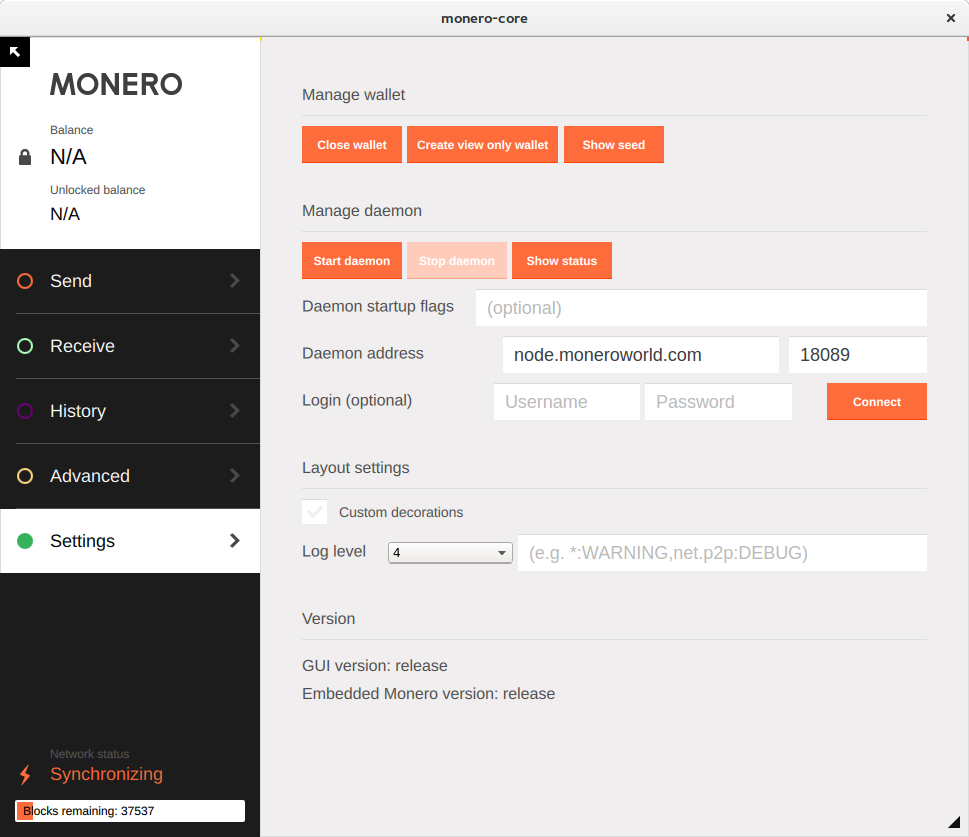



## Wyszukiwanie węzła

Pierwszą rzeczą jest znalezienie węzła, aby się podłączyć. [Moneroworld.com](https://moneroworld.com/#nodes) posiada dobre materiały służące odnajdywaniu węzłów. Jedną z najprostszych metod jest użycie węzła prowadzonego przez moneroworld, ale oni mają także narzędzie służące do wynajdywania losowych węzłów.

## Łączenie się z węzłem przez portfel Graficznego Interfejsu Użytkownika
Po wpisaniu hasła do portfela pojawi się okienko z opcją użycia niestandardowych ustawień, kliknij na nie. Zostaniesz przeniesiony do strony z ustawieniami w Graficznym Interfejsie Użytkownika. W tym momencie powinieneś zobaczyć dwa okienka tekstowe po prawej stronie etykietki "Adres daemona". W pierwszym okienku (po lewej) wpisz adres węzła, z którym chcesz się połączyć. Adres ten może wyglądać na przykład `node.moneroworld.com` lub jak jakikolwiek adres IP. W mniejszym okienku po prawej stronie wpisz port węzła. Domyślnym portem jest `18081`, ale jeśli używasz losowego węzła, port się zmieni- Port dla node.moneroworld.com to 18089.

### Twój ekran powinien wyglądać mniej więcej tak:
{:width="600px"}
