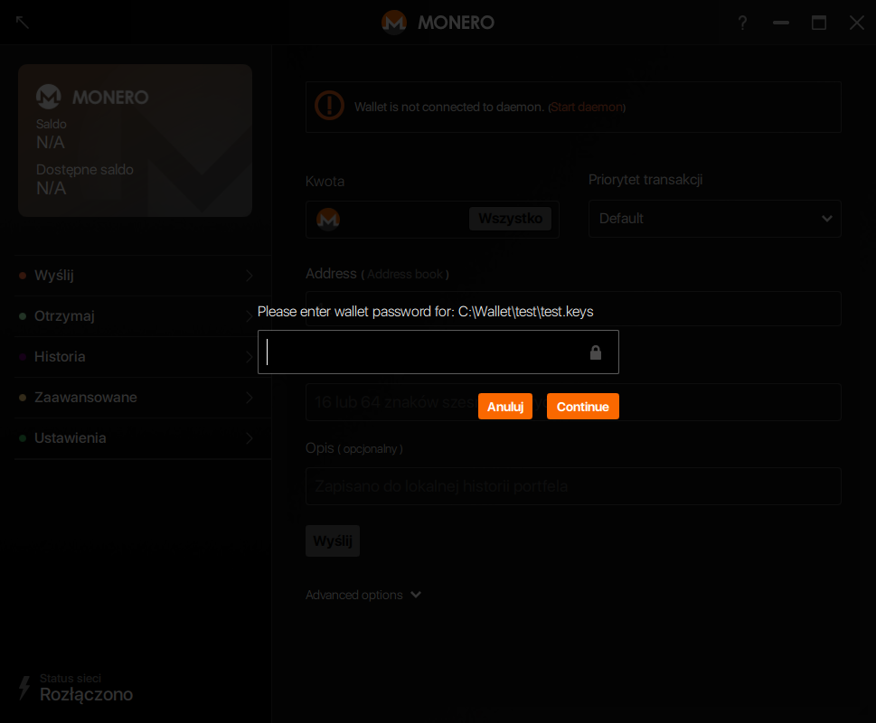
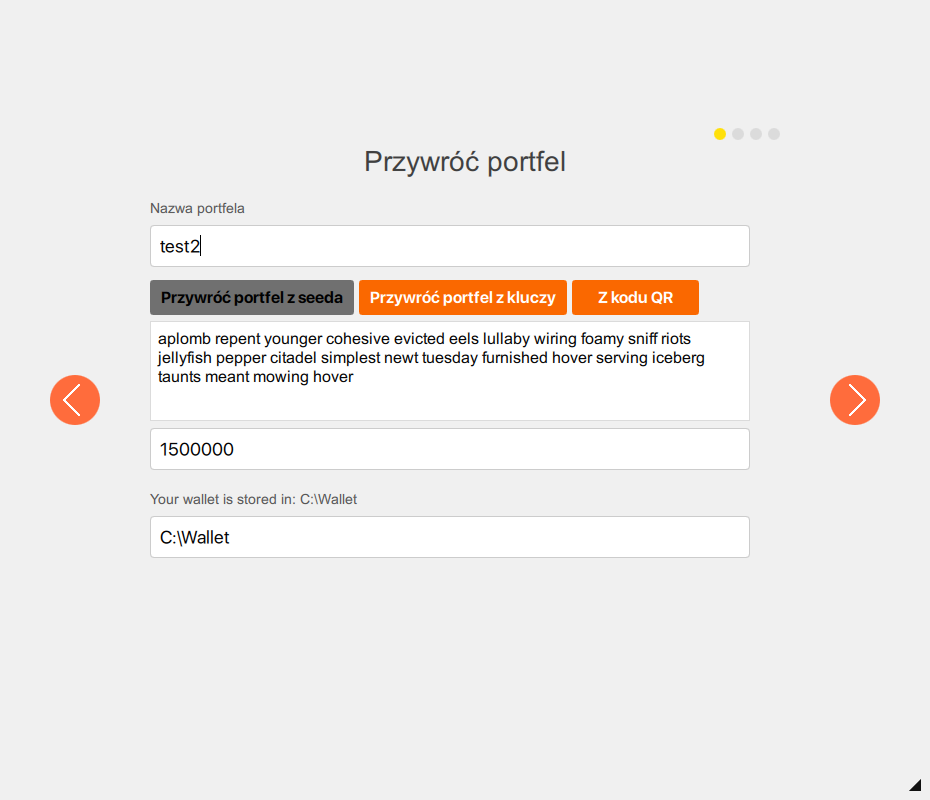
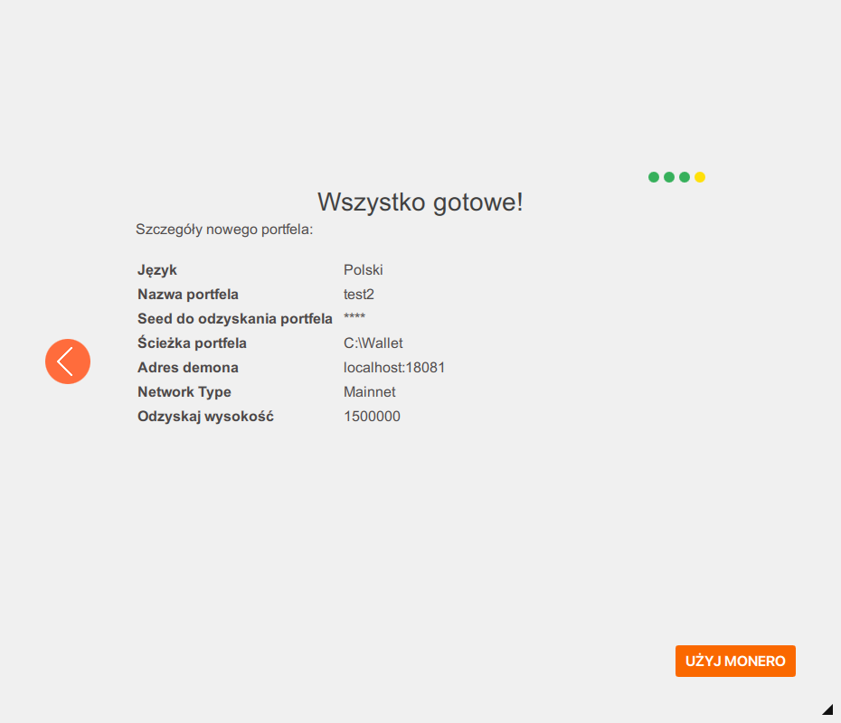

## Systemy operacyjne:  Windows, Linux, Mac

- Przygotuj swój 25-słowny kod mnemoniczny, który zachowałeś przy zakładaniu swojego starego portfela Monero

### Oprogramowanie konta:  monero-wallet-cli

- Otwórz wiersz polecenia i przejdź do dysku i folderu zawierającego monero-wallet-cli

- W wierszu poleceń wpisz: `monero-wallet-cli --restore-deterministic-wallet`

- Po wciśnięciu Enter zostaniesz poproszony o podanie nowej nazwy pliku portfela. Nazwij go jakkolwiek

- Naciśnij Enter ponownie i zostaniesz poproszony o hasło. Nadaj swojemu portfelowi nowe, długie hasło

- Naciśnij Enter ponownie i zostaniesz poproszony o powtórzenie hasła

- Naciśnij Enter ponownie i zostaniesz poproszony o 25-słowny kod mnemoniczny, który przygotowałeś wcześniej

-  Następnie pojawi się wiadomość "Przywróć z określonej wysokości łańcucha bloków (opcjonalne, domyślnie 0)". Domyślnie proces przywracania zacznie się od początku łańcucha bloków monero. Jeśli nie znasz dokładnej wysokości łańcucha, naciśnij Enter. Uściślenie wysokości łańcucha rozpocznie proces przywracania od tej konkretnej wysokości. Oszczędzi to trochę czasu przy skanowaniu, jeśli wiesz, na jakiej wysokości łańcucha twoje pierwsze fundusze zostały przesłane dla tego konta.

Po wpisaniu 25-słownego kodu mnemonicznego i wybraniu wysokości łańcucha bloków, monero-wallet-cli wygeneruje taki sam adres publiczny i klucz widoczności jak w twoim starym portfelu i automatycznie rozpocznie proces aktualizacji. Bądź cierpliwy, aktualizacja może zająć chwilę.

### Oprogramowanie konta:  monero-wallet-gui

Uruchom Graficzny Interfejs Użytkownika Monero. Jeśli uruchamiasz go po raz pierwszy, przejdź do następnego kroku, jeśli nie - kliknij `Anuluj`:

Wybierz odpowiedni język `Polski`:

Kliknij w `Odzyskaj portfel z kluczy lub mnemonicznego seeda`:

Zaznacz opcję `Przywróć portfel z seeda`, nazwij swój portfel i wybierz jego lokalizację i wpisz swój kod mnemoniczny w polu `Enter your 25 (or 24) word mnemonic seed`. Możesz opcjonalnie uściślić wysokość bloku w polu `Wysokość początkowa przywracania portfela (opcjonalne)`, aby uniknąć skanowania starszych bloków. Następniej kliknij w strzałkę w `prawo`:

Na następnej stronie ustaw silne hasło i potwierdź je, zanim ponownie klikniesz w strzałkę w `prawo`:

Sprecyzuj ustawienia swojego demona i kliknij w strzałkę w `prawo`:

Kliknij w `UŻYJ MONERO`, aby skorzystać ze swojego przywróconego portfela:

