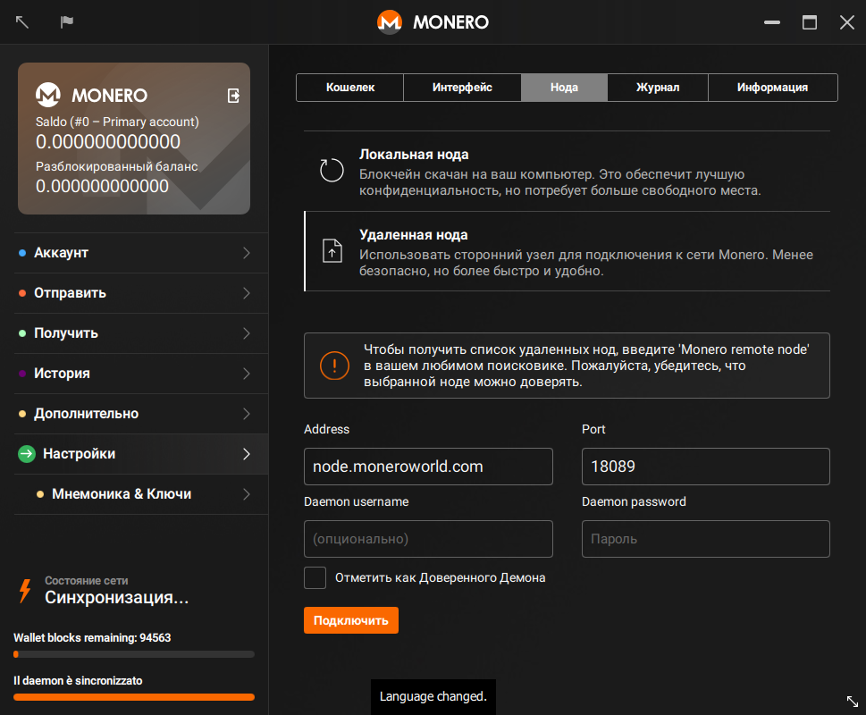



## Поиск удаленной ноды
Прежде всего, вам нужно найти ноду для подключения! [moneroworld.com](https://moneroworld.com/#nodes) есть несколько полезных ресурсов для поиска нод. Один из самых простых способов - использовать ноду, запущенную самим moneroworld, но у них также есть инструмент для поиска случайных других нод.

## Подключение к удаленной ноде из GUI кошелька
После ввода пароля от вашего кошелька вы увидите всплывающее окно - "use custom settings" (Использовать пользовательские настройки), которое даст вам возможность изменить настройки при первом запуске кошелька. Нажмите на него. Затем вы будете отправлены на страницу "Settings" (Настройки). На этом этапе вы должны переключится в режим "Remote node" (Удаленная нода). В первое поле "Address" (Адрес) вам нужно ввести адрес удаленной ноды, к которой вы хотите подключиться. Этот адрес может выглядеть как `node.moneroworld.com` или как IP-адрес. В поле "Port" (Порт) вы вводите порт для подключения к ноде. Порт по умолчанию - `18081`, но если вы используете случайную ноду, значение для порта подключения будет другим. Нода node.moneroworld.com использует порт `18089`.

### Данное окно должно выглядеть так:

