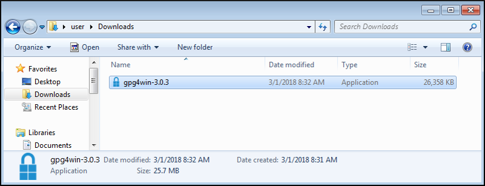



# Верификация двоичных файлов для Windows (для начинающих)

Верификация двоичных файлов Monero производится до извлечения, установки или использования программного обеспечения Monero. Это единственный способ убедиться в том, что вы используете официальный двоичный файл Monero. Если вами был получен поддельный двоичный файл Monero (например, фишинговый, MITM и т. д.), соблюдение правил, изложенных в данном руководстве, поможет избежать обмана, связанного с использованием такого файла.

Для защиты целостности двоичных файлов, команда Monero обеспечивает криптографически подписанный список всех хешей [SHA256.](https://en.wikipedia.org/wiki/SHA-2) Если загруженный вами двоичный файл был изменён, он будет выдавать хеш, [отличающийся](https://en.wikipedia.org/wiki/File_verification) от того, что находится в файле.

Это руководство для новичков, использующих операционную систему Windows, и практически во всех случаях будет использоваться исключительно графический интерфейс пользователя (GUI). В руководстве подробно рассматривается процесс установки необходимого программного обеспечения, импорта ключа подписи, загрузки необходимых файлов и, наконец, проверки аутентичности ваших двоичных файлов.

## Содержание

### [1. Установка Gpg4win](#1-using-gpg4win-installer)
  - [1.1. Получение программы установки Gpg4win](#11-getting-gpg4win-installer)
    + [1.1.1. Загрузка Gpg4win](#111-download-gpg4win)
    + [1.1.2. Запуск Gpg4win](#112-launch-gpg4win)
  - [1.2. Работа с программой установки Gpg4win](#12-use-gpg4win-installer)
### [2. Импорт ключа подписи](#2-monero-signing-key)
  - [2.1. Загрузка ключа подписи](#21-download-signing-key)
  - [2.2. Запуск утилиты Kleopatra](#22-initialize-kleopatra)
    + [2.2.1. Импорт ключа подписи](#221-import-signing-key)
    + [2.2.2. Создание пары ключей](#222-create-key-pair)
  - [2.3. Верификация ключа подписи](#23-verify-signing-key)
### [3. Верификация хеш-файла](#3-hash-file-verification)
  - [3.1. Загрузка хеш-файла](#31-download-hash-file)
  - [3.2. Верификация хеш-файла](#32-verify-hash-file)
### [4. Верификация двоичного файла](#4-binary-file-verification)
  - [4.1. Загрузка двоичного файла](#41-download-binary)
  - [4.2. Верификация двоичного файла](#42-verify-binary)

## 1. Программа установки Gpg4win

В этом разделе будет рассмотрен процесс установки криптографического программного обеспечения. В операционную систему Windows не входят инструменты, необходимые для верификации двоичных файлов. Для установки таких инструментов можно воспользоваться программой Gpg4win.

### 1.1. Получение программы установки Gpg4win

#### 1.1.1. Загрузка Gpg4win

Используя веб-браузер, необходимо открыть страницу [gpg4win.org](https://gpg4win.org) и загрузить программу установки: для этого достаточно нажать зеленую кнопку.

После этого вас перенаправят на страницу для сбора пожертвований. Если желание вносить пожертвование отсутствует, следует выбрать вариант `$0`, после чего можно будет нажать на кнопку `Download` [Загрузить]

После этого нужно нажать кнопку `Save File` [Сохранить файл].

Выбрать место для загрузки, а затем нажать `Save` [Сохранить].

#### 1.1.2. Запуск Gpg4win

По завершении загрузки нужно открыть папку с файлом.

Программа запускается двойным кликом по ярлыку исполняемого файла gpg4win.

### 1.2. Работа с программой установки Gpg4win

Должен появиться экрана проверки безопасности, в нём следует нажать `Run` [Запустить].

После этого необходимо выбрать язык и нажать `ОК`.

Появится экран приветствия. Нажать `Next` [Далее].

Теперь должен появиться экран выбора компонента. В соответствии с данным руководством необходимо оставить выбранной, по крайней мере, утилиту `Kleopatra`. Как только выбор будет сделан, нажать `Next` [Далее].

Если вы не совсем уверены в том, что делаете, лучше сохранить без изменений место установки, используемое по умолчанию. После того, как место установки будет выбрано, нажать `Install` [Установить].

После того, как установка будет завершена, нажать `Next` [Далее].

Нажать `Finish` [Завершить].

## 2. Импорт ключа подписи Monero

Данный раздел посвящён загрузке ключа подписи Monero, проверке его правильности и последующему импорту ключа в набор ключей. Хеш-файл, который будет использован для верификации двоичного файла, криптографически подписан ключом подписи Monero. Для проверки действительности данного файла необходима публичная версия ключа подписи.

### 2.1. Загрузка ключа подписи

Используя веб-браузер, необходимо открыть [Fluffypony's GPG key](https://raw.githubusercontent.com/monero-project/monero/master/utils/gpg_keys/fluffypony.asc), который используется для подписи двоичных файлов Monero, а затем правой кнопкой мыши щелкнуть по странице и выбрать `Save Page As` [Сохранить страницу как].

Оставить путь сохранения, используемый по умолчанию, и нажать `Save` [Сохранить].

### 2.2. Запуск утилиты Kleopatra

Если данная утилита используется впервые, будет необходимо создать для себя пару ключей.

Запустить Kleopatra.

#### 2.2.1. Импорт ключа подписи

Нажать `Import` [Импортировать].

Войти в директорию `Downloads` [Загрузки], выбрать `fluffypony` и нажать `Open` [Открыть].

 Чтобы запустить процесс сертификации ключа, нажать `Yes` [Да].

#### 2.2.2. Создание пары ключей

Для запуска процесса генерации ключа нажать `Yes` [Да].

Указать некоторую информацию в полях `Name` [Имя] и `Email` [Электронная почта] и нажать `Next` [Далее].

Проверить указанную информацию и нажать `Create` [Создать].

Ввести пароль и нажать `OK`.

Нажать `Finish` [Завершить].

### 2.3. Верификация ключа подписи

Визуально проверить, соответствует ли отпечаток ключа, принадлежащего Riccardo Spagni, `BDA6BD7042B721C467A9759D7455C5E3C0CDCEB9`.

В случае **СОВПАДЕНИЯ** отпечатка нажать `Next` [Далее].

В случае **НЕСОВПАДЕНИЯ** отпечатка данного ключа, **ПРОДОЛЖАТЬ НЕ СЛЕДУЕТ**. Необходимо удалить `fluffypony.asc` из директории `Downloads` и вернуться к [пункту 2.1](#21-download-signing-key).

Оставить отмеченным `Certify only for myself` [Подтвердить только для себя] и нажать `Certify` [Подтвердить].

Ввести свой пароль и нажать `OK`.

Нажать `Finish` [Завершить].

## 3. Верификация хеш-файла

Данный раздел касается загрузки подписанного файла с известными действительными хешами и проверке его подлинности.

### 3.1. Загрузка хеш-файла

Используя веб-браузер, открыть [страницу хеш-файлов на getmonero.org](https://getmonero.org/downloads/hashes.txt). Нажатием правой кнопки мыши на странице выбрать `Save Page As` [Сохранить страницу как].

Оставьте путь сохранения, используемый по умолчанию, и нажмите `Save` [Сохранить].

### 3.2. Верификация хеш-файла

В утилите Kleopatra нажать кнопку `Decrypt/Verify` [Расшифровать/проверить].

Указать путь к директории `Downloads`, выбрать файл `hashes` и нажать `Open` [Открыть].

Kleopatra должна сообщить, является ли подпись файлов действительной.

Если подпись **ДЕЙСТВИТЕЛЬНА**, появится следующее:

Если же подпись **НЕДЕЙСТВИТЕЛЬНА**, то появится следующее:

Если подпись **ДЕЙСТВИТЕЛЬНА**, следует нажать `Discard` [Не учитывать] и продолжить.

Если подпись **НЕДЕЙСТВИТЕЛЬНА**, **ПРОДОЛЖАТЬ НЕ СЛЕДУЕТ**. Вместо этого необходимо удалить файл `hashes` из директории `Downloads` и вернуться к [пункту 3.1](#31-download-hash-file).

## 4. Верификация двоичного файла

В этом разделе описаны загрузка двоичного файла Monero и проверка его аутентичности.

### 4.1. Загрузка двоичного файла

Используя веб-браузер, перейти на [страницу загрузок getmonero.org](https://getmonero.org/downloads/#windows) и выбрать подходящий для вашей системы двоичный файл.

Выбрать `Save File` [Сохранить файл] и нажать `OK`.

Оставить без изменений путь для сохранения, используемый по умолчанию, и нажать `Save` [Сохранить].

### 4.2. Проверка бинарного файла

Используя файловый менеджер, перейти в директорию `Downloads`, открыть файл `hashes` при помощи текстового редактора.

Открыть командную консоль (`cmd.exe`).

Изменить путь на директорию `Downloads` при помощи команды `cd Downloads`.

Вычислить хеш двоичного файла Monero, используя команду `certUtil -hashfile monero-gui-win-x64-v0.11.1.0.zip SHA256` (при этом, если вы загрузили версию, поддерживающую только командную строку, замените также и `monero-gui-win-x64-v0.11.1.0.zip`).

Сравнить хеш в консоли с хешем из хеш-файла. Они должны быть одинаковыми (пробелы можно не учитывать).

Если хеш **СОВПАДАЕТ**, значит верификация закончена! Вы можете быть уверены в том, что используемые вами файлы Monero являются аутентичными. Теперь файлы можно извлечь и установить/использовать в обычном режиме.

Если хеш **НЕ СОВПАДАЕТ**, **ПРОДОЛЖАТЬ НЕ СЛЕДУЕТ**. Необходимо удалить двоичный файл Monero из директории `Downloads` и вернуться к [пункту 4.1](#41-download-binary).
