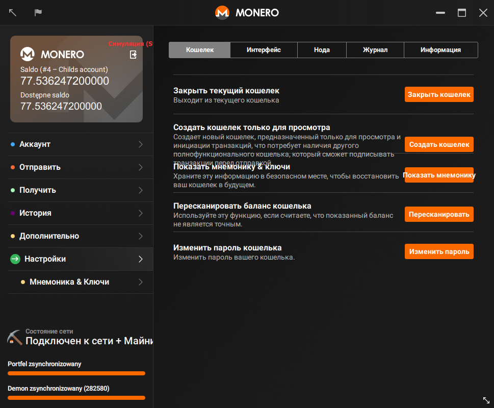
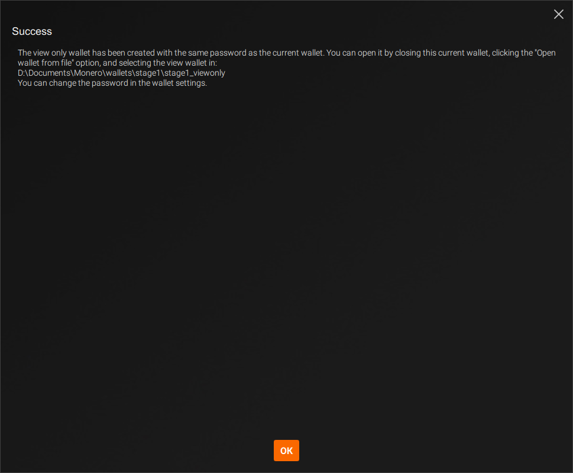



Кошелек для просмотра может видеть только то, какие входящие транзакции принадлежат вам. С помощью него нельзя потратить ваши Monero. На самом деле он даже не может видеть исходящие транзакции из этого кошелька. Это делает кошелек для просмотра исключительно интересным в следующих целях:

* Разработчикам, которые создают библиотеки для проверки платежей
* Конечным пользователям, проверяющих входящие транзакции на холодные кошельки

### Создание кошелька только для просмотра

Вы можете создать кошелек, предназначенный только для просмотра, из любого существующего кошелька.

#### CLI

Откройте существующий кошелек или создайте новый, используя `monero-wallet-cli`. В кошельке введите `address` и `viewkey`, чтобы отобразить адрес кошелька и приватный ключ просмотра. Введите `exit`, чтобы закрыть кошелек.

Затем создайте свой кошелек только для просмотра, набрав команду `monero-wallet-cli --generate-from-view-key wallet-name`. Последним аргументом "name" будет имя вашего нового кошелька. Вам будет предложено ввести `Standard address` (Стандартный адрес) и приватный `View key` (Ключ просмотра) в кошельке. Вставьте свой оригинальный стандартный адрес кошелька и приватный ключ просмотра. Затем введите и подтвердите пароль для своего нового кошелька. После этого кошелек для просмотра будет создан и готов для использования.

#### GUI

Откройте существующий кошелек или создайте новый, используя `monero-wallet-gui`. В кошельке перейдите на страницу `Settings` (Настройки):

Нажмите `Create a view only wallet` (Создать кошелек только для просмотра) > `Create wallet` (Создать кошелек), кошелек будет создан в том же каталоге, где располагаются ваши другие кошельки.

При необходимости дважды щелкните по окну `Success` (Успешно), чтобы скопировать сообщение, затем нажмите `ОК`, чтобы закрыть окно:

