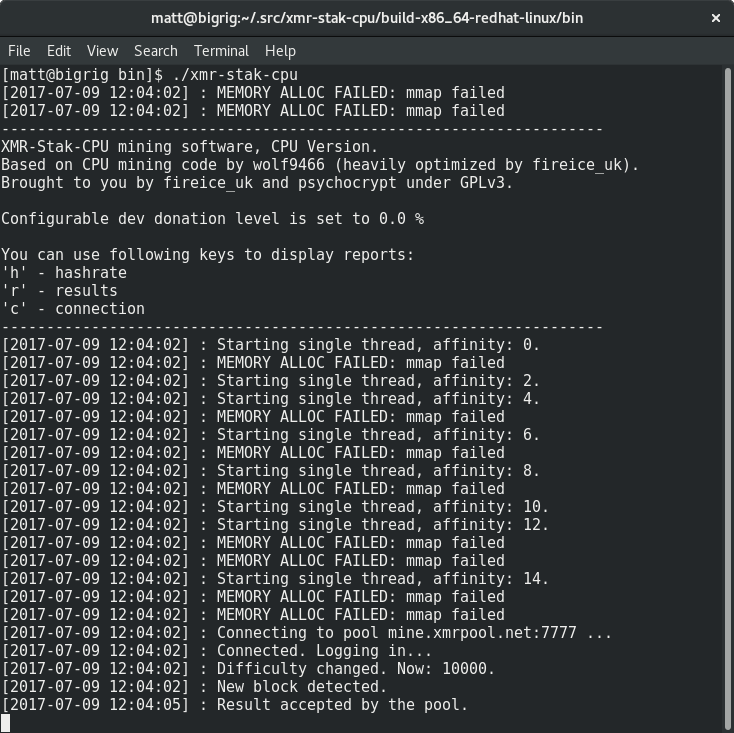

# Bir havuz seçme

Seçebileceğiniz birçok havuz var, kapsamlı bir liste [moneropools.com](https://moneropools.com) adresinde mevcut. Daha büyük bir havuzda çıkarma yapmanız daha sık ödeme almak anlamına gelse de küçük havuzlarda çıkarmak ağın merkezsiz olmasına katkıda bulunur.

# Bir CPU madencisi seçme

Havuzda olduğu gibi, seçebileceğiniz birçok maden yazılımı mevcut. Seçmeniz gereken yazılım kullanacağınız donanıma bağlıdır. Bu rehberde yalnızca bir CPU madencisi olan  [xmr-stak-cpu](https://github.com/fireice-uk/xmr-stak-cpu) açıklanmaktadır. Alternatif olarak  [wolf's CPUMiner](https://github.com/wolf9466/cpuminer-multi) ve
[sgminer-gm](https://github.com/genesismining/sgminer-gm) kullanılabilir. Ancak bunların ayarları biraz farklıdır ve bu rehberde açıklanmayacaktır.

## Windows İşletim Sistemleri İçin

Windows kullanıyorsanız, xmr-stak-cpu’nun geliştiricisi dosyaları şu adreste sağlamaktadır: [GitHub yayın sayfası](https://github.com/fireice-uk/xmr-stak-cpu/releases).

`xmr-stak-cpu-win64.zip` dosyasını indirin ve sonra tekrar bulabileceğiniz bir dizinde açın.

## Diğer İşletim Sistemleri İçin

Windows kullanmıyorsanız xmr-stak-cpu’yu kendiniz derlemeniz gerekecek, şansınıza bu görüldüğü kadar zor değil. Yazılımı derlemeden evvel bazı öngerekliliklerini yüklemeniz gerekecek.

Debian-bazlı dağıtımlar için:

    sudo apt-get install libmicrohttpd-dev libssl-dev cmake build-essential

Red Hat bazlı dağıtımlar için:

	sudo yum install openssl-devel cmake gcc-c++ libmicrohttpd-devel

<!-- TODO: Diğer işletim sistemleri için de gereklilikleri ekle? -->

Sonrasında cmake kullanarak işlem dosyalarını oluşturmanız, make komutunu koşturup config dosyasını kopyalamanız gerek:

    mkdir build-$(gcc -dumpmachine)
	cd $_
	cmake ../
	make -j$(nproc)
	cp ../config.txt bin/
	cd bin

Hemen sevinmeyin çünkü önce madencinin ayarlanması gerek. Yazılım, çalıştırmanız durumunda size kopyalayıp yapıştırmanız için bir metin bloğu verecek:

`config.txt` dosyasını açın, iki `"cpu_threads_conf"` satırını kopyalamış olduğunuz metinle *değiştirin*. Görünüm şuna benzemeli::

Dosyada `"pool_address"` satırlarını görünceye dek altlara ilerleyin. Burada çift tırnak arasındaki yerleri daha önceden seçmiş olduğunuz havuzun adres ve portuyla *değiştirin*. Bu bilgiyi havuzun web sayfasında bulabilirsiniz.

Cüzdan adresi kısmına çift tırnak arasında kendi cüzdan adresinizi koyun. Havuz özellikle belirtmediyse parola kısmını boş bırakabilirsiniz.

Sonrasında ayarlarınız şuna benzemeli:

# Madenciyi çalıştırma

**Ayarlarınızı kaydedin** ve madenciyi çalıştırın!

Bazı havuzlar adresinizle hash oranınızı kontrol etmenize olanak sağlayabilir. Ayrıca hash oranınızı `h` tuşuna basarak da kontrol edebilirsiniz.

# Madenciyi Ayarlamak

Bazen şuna benzer kötü mesajlar görebilirsiniz:

	[2017-07-09 12:04:02] : MEMORY ALLOC FAILED: mmap failed

Bu, büyük sayfaları etkinleştirerek %20 oranında bir hash oranı artışı sağlayabilirsiniz demektir.

## Linux'ta Büyük Sayfalar

Öncelikle madenciyi (çalışıyorsa) durdurun, büyük sayfaları etkinleştirmek ve madenciyi başlatmak için alttaki komutları çalıştırın:

	sudo sysctl -w vm.nr_hugepages=128
	sudo ./xmr-stak-cpu

## Windows'ta Büyük Sayfalar

`config.txt`'ten alınmıştır':

>Varsayılan olarak büyük sayfalar tahsis edeceğiz. Öncelikle Windows’ta Yönetici olarak Çalışmanız gerek. Sisteminizin grup özelliklerini düzenleyerek büyük sayfalar kilidini aktif hale getirmeniz lazım. Gerekli adımlar aşağıdaki gibidir:
1. Başlangıç menüsünde Çalıştır’a tıklayın. Aç kutusuna gpedit.msc yazın.
2. Yerel Grup İlkesi Düzenle konsolunda, önce Bilgisayar Ayarları’nı, sonrasında Windows Ayarları’nı genişletin.
3. Güvenlik Ayarları’nı, sonra Yerel İlkeleri genişletin.
4. Kullanıcı Hakları Ataması dizinini seçin.
5. İlkeler detaylar penceresinde gösterilecektir.
6. Pencerede Sayfaları Bellekte Kilitle’ye çift tıklayın.
7. Yerel Güvenlik Ayarları’nda - Sayfaları Bellekte Kilitle diyalog kutusunda, Kullanıcı veya Grup Ekle’ye tıklayın.
8. Kullanıcı, Servis Hesabı veya Grup Seç penceresinde madenciyi çalıştıracağınız bir hesap ekleyin
9. Değişikliklerin etkinleşmesi için bilgisayarınızı tekrar başlatın.
