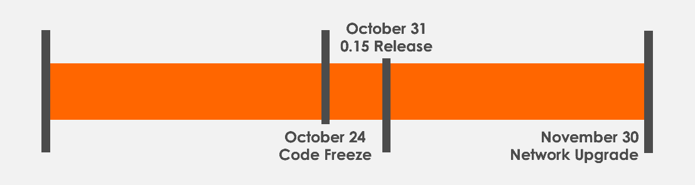

Dear participants of the Monero ecosystem,

A tentative schedule for the upcoming scheduled network upgrade has been set. The schedule is as follows:

**October 24** - _Code freeze_  
**October 31** - _Targeted v0.15 release date_  
**November 30** - _Network upgrade_

Thus, approximately the 30th of November there will be a scheduled network upgrade on the Monero network. To be sufficiently prepared, a user, service, merchant, pool operator, or exchange should run CLI v0.15 or GUI v0.15. The scheduled network upgrade introduces a few major changes. First and foremost, a new long-term Proof-of-Work algorithm, namely **RandomX**, will be introduced. Miners therefore ought to upgrade their mining software as well. Second, **long payment IDs will be phased out** in order to improve privacy and user experience as well as reduce support work for services and exchanges. Third, **transactions will now require at least two outputs**. Fourth, the **ten block (approximately twenty minutes) lock time** for incoming transactions will be enforced on the protocol level. Both these changes will improve privacy for the user as well as for the whole network.

To reiterate, following [our earlier announcement](https://lists.getmonero.org/hyperkitty/list/monero-announce@lists.getmonero.org/thread/NQCMZHCW557QG4QX752ZTBETRWLF2P63/), long payment IDs will be phased out in this scheduled network upgrade.

Services still utilizing long payment IDs are thus reminded to _upgrade to either integrated addresses or subaddresses as soon as possible_. If any assistance is required, feel free to contact the Monero dev community at #monero-dev (freenode - IRC, Riot/Matrix, [MatterMost](https://mattermost.getmonero.org)).

Note that a preliminary information thread regarding the scheduled network upgrade [has been posted on Reddit](https://www.reddit.com/r/Monero/comments/d884zt/preliminary_information_thread_regarding_the/) that contains more elaborate information for users and miners.

Kind regards,

_The Monero dev community_
