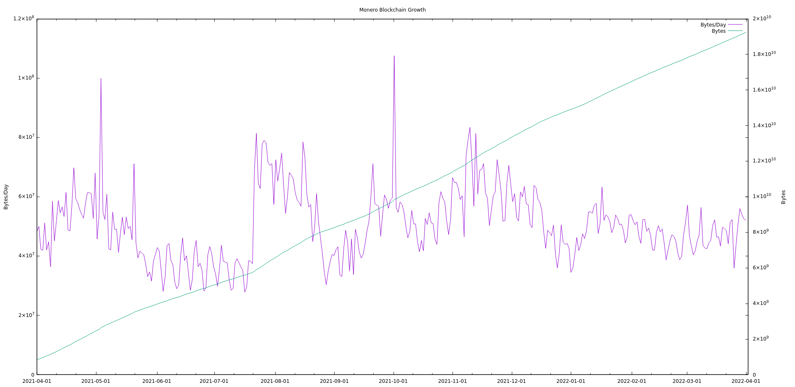
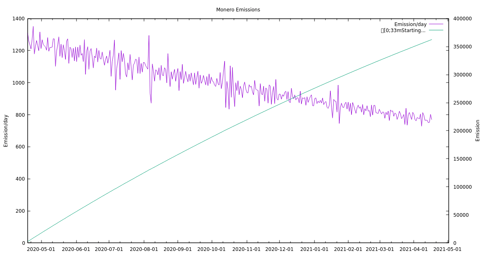

As a way to celebrate and show the growth that has happened for Monero across the past year on this, the 8th anniversary of the Monero project, I wanted to take a snapshot of statistics and social media posts to highlight this growth.

This is by no means an exhaustive list of ways in which Monero grew, and some of the most important growth came in increased acceptance and adoption of Monero for donations and payments:

- [Merchants accepting Monero for payment](https://www.getmonero.org/community/merchants/)
- [FOSS Projects and Pro-Privacy Organizations accepting Monero for donations](https://sethforprivacy.com/posts/foss-donations/)
- [Coincards Monero Volume](https://twitter.com/CoinCards/status/1508324025256202246?cxt=HHwWjMCqubSt0u4pAAAA)

# Statistics

One of the most important ways we can deduce what has been happening in Monero is to look at the (thankfully, sparse) blockchain data available publicly.

Each section will highlight the previous year (04/2020 through 04/2021) as well as the current year (04/2021 through 04/2022) to give year-over-year comparisons and perspective.

## Transactions

**_04/2020 through 04/2021:_**

- Monero transactions grew from ~10,000tx per day to ~23,000tx per day
- There were **_5,868,096_** total transactions, for an average of **_16,076_** transactions per day for the year

**_04/2021 through 04/2022:_**

- Monero transactions grew from ~23,000tx per day to ~40,000tx per day
- There were **_9,087,482_** total transactions, for an average of **_23,542_** transactions per day for the year

### Year over Year Growth

Monero's on-chain usage grew **_154%_** YoY! Every one of these transactions was done via private-by-default transactions that protect sender, receiver, and amounts.

## Blockchain Growth

**_04/2020 through 04/2021:_**

- Monero's blockchain grew **_13.34GB_** in a year.
- There were **_262,588_** total blocks, for an average size of **_53.30KB_** per block for the year.
- There were **_5,868,096_** total transactions, for an average of **_2.38KB_** per transaction.

**_04/2021 through 04/2022:_**

- Monero's blockchain grew **_19.24GB_** in a year.
- There were **_262,567_** total blocks, for an average size of **_73.27KB_** per block for the year.
- There were **_9,087,482_** total transactions, for an average of **_2.11KB_** per transaction.

### Year over Year Growth

Monero's blockchain size grew **_144%_** faster YoY.

## Emissions

**_04/2020 through 04/2021:_**

- Monero's block subsidy (emission) created **_362,406.83XMR_**.
- There were **_262,588_** total blocks, for an average block subsidy of **_1.38XMR_** per block for the year.
- Monero's emission per day dropped from **_~1,200XMR_** to **_~750XMR_** over the course of the year.

**_04/2021 through 04/2022:_**

- Monero's block subsidy (emission) created **_237,822.80XMR_**.
- There were **_262,567_** total blocks, for an average block subsidy of **_0.90XMR_** per block for the year.
- Monero's emission per day dropped from **_~803XMR_** to **_~458XMR_** over the course of the year.

### Year over Year Change

Monero's annual inflation decreased **_34.3%_** YoY while daily emission dropped **_42.96%_** and is rapidly approaching the [tail emission](https://localmonero.co/knowledge/monero-tail-emission) of **_0.6XMR_** per block!

## Fees

**_04/2020 through 04/2021:_**

- Monero's participants spent **_1,884.77XMR_** on fees in a year.
- Monero averaged **_5.16XMR_** in fees spent per day.
- There were **_262,588_** total blocks, for an average total fees to miners of **_0.00717767XMR_** per block for the year.
- There were **_5,868,096_** total transactions, for an average of **_0.000321189XMR_** per transaction.

**_04/2021 through 04/2022:_**

- Monero's participants spent **_1,510.77XMR_** on fees in a year.
- Monero averaged **_4.12XMR_** in fees spent per day.
- There were **_262,567_** total blocks, for an average total fees to miners of **_0.00575384XMR_** per block for the year.
- There were **_9,087,482_** total transactions, for an average of **_0.000166247XMR_** per transaction.

### Year over Year Growth

Monero's fees spent decreased **_19.84%_** YoY while the average transaction fee dropped **_48.24%_**

## Mining

**_04/2020 through 04/2021:_**

- Monero's network hashrate increased from **_1.21GH/s_** to **_2.29GH/s_** over the year.

**_04/2021 through 04/2022:_**

- Monero's network hashrate increased from **_2.29GH/s_** to **_3.51GH/s_** over the year.

### Year over Year Growth

Monero's network hashrate increased **_53.27%_** YoY

## Reddit

**_04/2020 through 04/2021:_**

- Monero's main subreddit, [r/Monero](https://www.reddit.com/r/Monero) gained **_~43,000_** subscribers, going from **_~168,000_** to **_~211,000_** subscribers over the year.

**_04/2021 through 04/2022:_**

- Monero's main subreddit, [r/Monero](https://www.reddit.com/r/Monero) gained **_~46,000_** subscribers, going from **_~211,000_** to **_257,000_** subscribers over the year.

### Year over Year Growth

Monero's subreddit subscriber count grew **_21.80%_** YoY

## Twitter

**_04/2020 through 04/2021:_**

- Monero's main Twitter account, [@monero](https://twitter.com/monero) gained **_69,209_** followers.
- The @monero Twitter account went from **_319,884_** to **_389,093_** followers.

**_04/2021 through 04/2022:_**

- Monero's main Twitter account, [@monero](https://twitter.com/monero) gained **_84,397_** followers.
- The @monero Twitter account went from **_389,093_** to **_473,490_** followers.

### Year over Year Growth

Monero's Twitter follower count grew **_21.69%_** YoY

# Highlighted CCS Campaigns

- [Haveno Frontend Development](https://ccs.getmonero.org/proposals/haveno-frontend.html)
- [Monerokon 2022](https://ccs.getmonero.org/proposals/MoneroKon-2022-CCS.html)
- [Seraphis POC](https://ccs.getmonero.org/proposals/seraphis-wallet-poc.html)
- [ETH XMR Atomic Swaps](https://ccs.getmonero.org/proposals/noot-eth-xmr-atomic-swap.html)
- [OSPEAD](https://ccs.getmonero.org/proposals/Rucknium-OSPEAD-Fortifying-Monero-Against-Statistical-Attack.html)

# Major Upgrades

- [Bulletproof+](https://github.com/monero-project/monero/pull/7170)
- [P2Pool Support](https://github.com/monero-project/monero/pull/7964)
- [Output Export Optimization](https://github.com/monero-project/monero/pull/8179)

# Something Missing?

If you see something missing from this post that was a major highlight of the year, please feel free to open an issue on [Github](https://github.com/monero-project/monero-site) and tag @reemuru, and I will update ASAP.

# Resources Used

Here is a quick list of the sources and tools I used to gather these statistics:

- `monero-blockchain-stats`, using some hints from the following link for plotting:
  - <https://github.com/monero-project/monero/pull/4694>
- [Gnuplot](https://www.gnuplot.info/) for the graphs from data pulled via `monero-blockchain-stats`
- <https://miningpoolstats.stream/monero> for hashrate graph and current miner count
- <https://subredditstats.com/r/monero> for subreddit-related statistics and graphs
- <https://github.com/oduwsdl/FollowerCountHistory> for Twitter follower count history for @monero
- 8 years logo by u/Wataru_Watanabe
